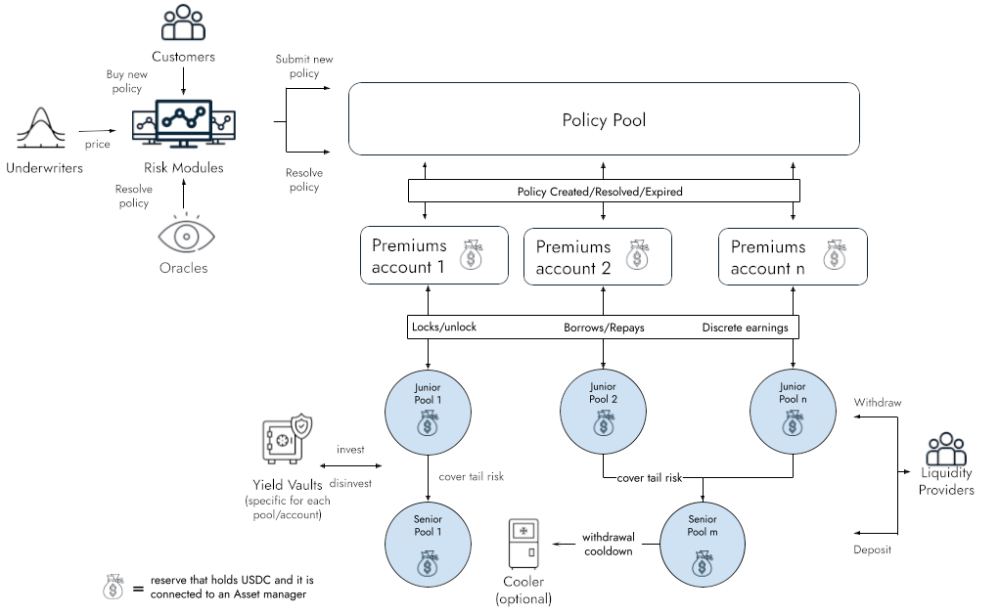

# Architecture

Ensuro smart contracts are coded in Solidity, and the codebase is [open-source](https://github.com/ensuro/ensuro).

You can find more details about the underlying design on [our whitepaper](https://ensuro.co/Ensuro_whitepaper.pdf).

## Architecture

## Contracts

The protocol comprises several smart contracts, some unique for each instance of the protocol, while others can have multiple instances.

Here's a brief description of the contracts.

### PolicyPool

PolicyPool is the protocol's main contract. It keeps track of active policies and receives spending allowances. It has methods for LP to deposit/withdraw, acting as a gateway. The PolicyPool is connected to a set of eTokens, Premiums Accounts, and RiskModules, keeping the registry of which are in the protocol. It also tracks the active exposure and the exposure limit for each RiskModule. This contract also follows the ERC721 standard, minting an NFT for each policy created. The owner of the NFT is who will receive the payout in case there's any.

### EToken

EToken is an ERC20-compatible contract that counts the capital of each liquidity provider in a given pool. The valuation is one-to-one with the underlying stablecoin (a rebasing token). The view `scr()` returns the amount of capital that's locked backing up policies. For this capital locked, the pool receives an interest (see `scrInterestRate()` and `tokenInterestRate()`) that is continuously accrued in the balance of eToken holders. It can have an optional *Cooler* contract that handles the cooldown period for withdrawals. If no *Cooler* is defined, the withdrawals are immediate (provided the `utilizationRate()` after the withdrawal is under 100%).

### RiskModule

This contract allows risk partners and customers to interact with the protocol. The specific logic regarding pricing is delegated to the *Underwriter* contract. RiskModule must be called to create a new policy; after calling the *Underwriter* to validate and build the price, it builds the Policy object and submits it to the PolicyPool.

### PremiumsAccount

The risk modules are grouped in premiums accounts that keep track of their policies' pure premiums (active and earned). The responsibility of these contracts is to keep track of the premiums and release the payouts. When premiums are exhausted (losses more than expected), they borrow money from the eTokens to cover the payouts. This money will be repaid when/if later the premiums account has a surplus (losses less than expected).

### Reserve

Both _eTokens_ and _PremiumsAccounts_ are _reserves_ because they hold assets. It's possible to assign to each reserve a *yield vault*. This *yield vault* is an ERC-4626 contract that invests the delegated funds to generate additional returns by investing in other DeFi protocols.

### LPWhitelist

This is an optional component. If present, it controls which Liquidity Providers can deposit or transfer their _eTokens_. Each eToken may or may not be connected to a whitelist.

### Cooler

This is an optional component. If present, it controls the cooldown period required to withdraw funds from a given _eToken_. Each eToken may or may not be connected to a cooler.

### Policy

Policy is a library with the struct and the calculation of relevant attributes of a policy. It includes the logic around the premium distribution, SCR calculation, shared coverage, and other protocol behaviors.
