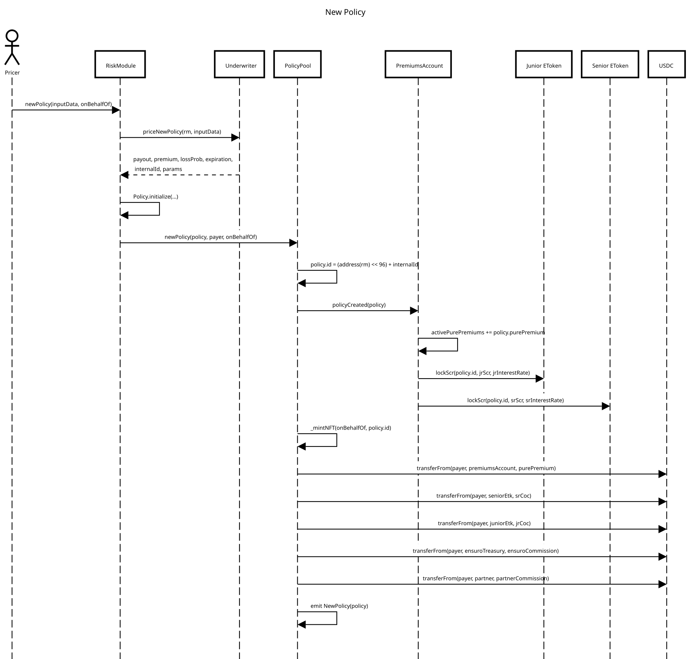
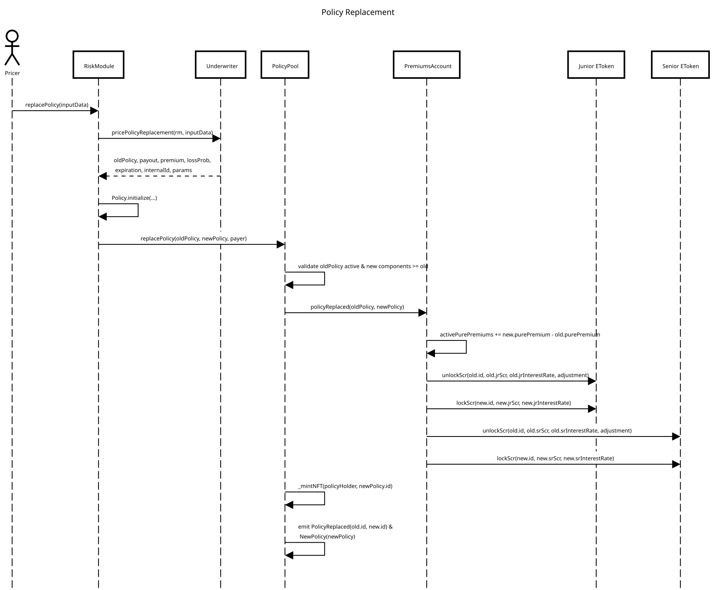
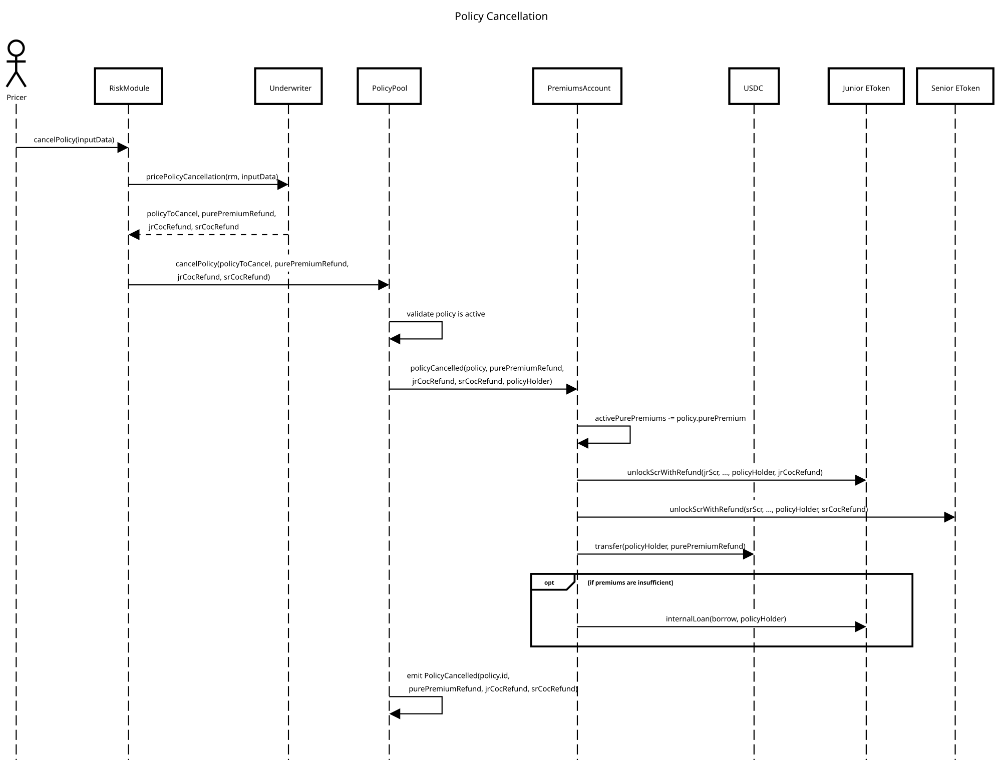
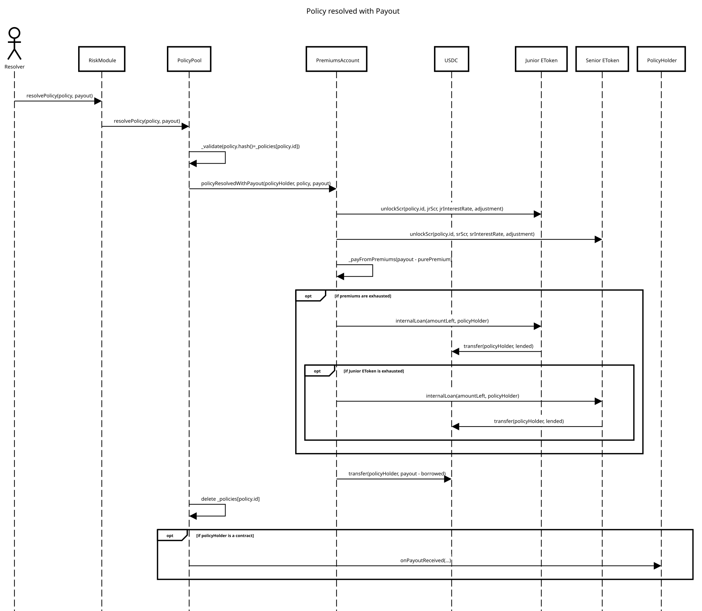
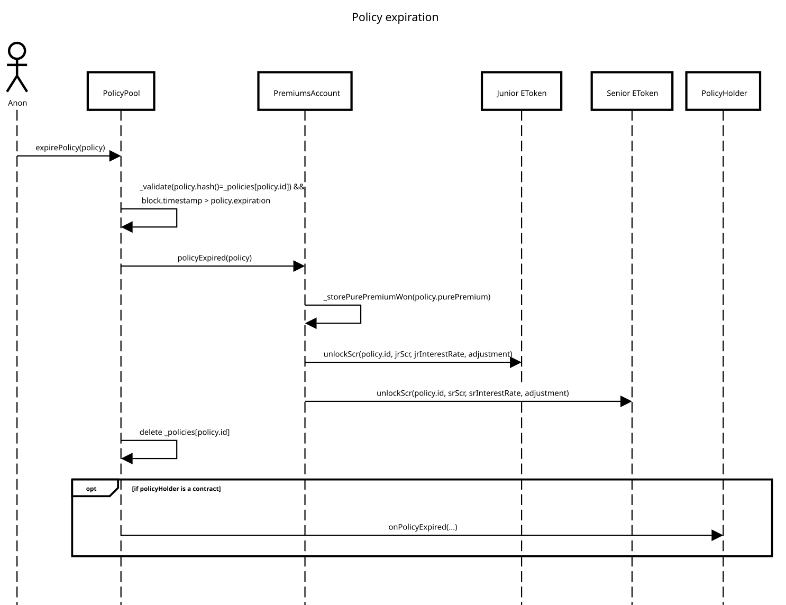

# Policy Lifecycle

## New Policy

New Policy transactions are sent to _risk modules_. Each risk module delegates the pricing and validation of the policy to an _Underwriter_ contract, which decodes the `inputData` provided by the caller and returns the parameters required to build the policy:

* **payout**: the maximum amount paid for this policy to the policyholder.
* **premium**: the amount paid as a premium.
* **lossProb**: the estimated probability of having to do a payout equal to the maximum payout.
* **expiration**: the expiration date of the policy (timestamp). After this date, the policy is no longer claimable.
* **internalId**: a user-defined id that has to be unique within a risk module.
* **params**: the pricing parameters (margin of conservatism, collateralization ratios, returns on solvency capital and fee percentages) used to compute the policy's solvency and premium split.

> **Note:** The **lossProb** is used to calculate the expected losses of a policy. If the policy can have multiple payouts, the lossProb is computed as the ratio between expected losses and maximum payout. For example, if the maximum payout is $ 100, and the payouts can be $ 100 with 10% of chances and $ 50 with 5% of chances, then the lossProb will be 12.5%.

Based on these parameters, a [Policy](policy.md) is created and sent to the _PolicyPool_.

Here you can see a sequence diagram of the process with all the contracts involved. As a final result, we should see the following effects:

1. A new Policy is _stored,_ and an NFT is minted for the policyholder. The NFT represents the policy's ownership, and the owner of the NFT will receive the payout.
2. The solvency capital sourced from the liquidity pools (_eTokens_) is locked until the policy is triggered or expires.
3. The premium amount is transferred from the payer and split among the different parties:
   1. The cost of capital is paid to the junior and senior eTokens.
   2. The commissions are paid to Ensuro and the risk partner.
   3. The pure premium is sent to the PremiumsAccount contract associated with the risk module.
4. A NewPolicy event with all the Policy fields that will be needed for upcoming operations.

[Open the sequence diagram in a new window](https://sequencediagram.org/index.html?presentationMode=readOnly#initialData=C4S2BsFMAIDlIO7QAoHtwgMYE8BQuBDTYVAJxVK0lNwAcDTRMR6A7YaAJRAGcBrALKoAJgFcodBkxYF20AKqth1BJWDVJjLDLloMONOk3S2HZKUgBbEKMs8AgpkypR7Y9tPQAUq5BloAKIAKqh8kKzuzJ4AyuF+5MGh4ZE6HPLRACIAwvjmVKQAtAB83PxCYlAAXKyIeljYABQgrLSiwBkEwAQANNCorABCkAAWBOAAZgDy4wCUuKWCIuKQxYrKpKpg1JW0lJiQ8Ah1OA2klr3Nre2dBHNrKmrUBcUL5cs7BNguwL27VjbnaDgVA8HjmVAAI16kAAHrQQKROn5WN0ADqsaDNdSkVhjACSwl+DAIdnmvEWFRWJXJbyqx2wADpmmAQGMQAAvSANBk8uavJZQYr0wzgaq1dD1Bq0CU4InYai9fpDUYTaZzYWodBCmXYEU7HVM4TQAC80AaBGEwgsoNOlhm0AAPA7oABOABs9oA1Jj2NRceACbgNVqiuZ-rYHE4XOx9fpsFkLJ1IMIpTr1RZrBHHM5XMAhRmAZGczGiKAAG6QZCiCxhzN2aCe03SuMM1o1gu2IMduzZ6N5oo+VjxQIhMKsSrAzB8aKYUiplsgQnQABWpBnpF6q7xvutwE4SfT4Z7UdzxViQ-8iTHE9QU-X8-qht6PDXs+fpG32MgPD3B6DOpFbU4z1AB9ax2FgAAxIIGiVEYximcZfgNRd1QAzVwFWTIskqYBEVYHhxmoSDSFQSwpU+BVoD+Osiz7X5q0rbs0OAjCsOyXD8MI4jSPI+h5Q3aAeDiMgAmAPh3yyW8WPqQCinSDi8NkbjSBIsiKIEzdfFE8TN1IKTMBkgw2Pk7DOOUojVN4jSqPCHhq1QIJE3s0hsGhAiHKkyxrFBZEjN1EyFJwpSCMstS+MowT6EYGooqkWKvJ8ng-P-ViQ2DUV-g4Q56QfHA5iAA).

> **Note:** The pricing parameters (`params`) are not stored on-chain in the risk module; they are provided off-chain by the risk partner (or an authorized signer) and validated by the _Underwriter_ contract. There are two underwriter implementations: the _Full Signed Underwriter_ (which validates a signature from an authorized signer) and the _Full Trusted Underwriter_ (which simply trusts the caller).
>
> Policies can also be created in batch with `newPolicies` (RiskModule) / `newPoliciesBatch` (PolicyPool), which aggregate the premium transfers.

In the process of creation of a policy, several things are validated and can fail, reverting the operation:

* Risk module deprecated or suspended.
* Lack of available funds in the eTokens to cover the required solvency capital (SCR).
* Not enough funds in the payer's wallet to pay the premium or no allowance for spending given to the PolicyPool.
* Repeated policyId/internalId (used to avoid repeated transactions).

## Policy replacement

An active policy can be replaced with a new one, keeping the same owner. The replacement is flexible: almost everything can change — the exposure (payout), the expiration, the collateralization ratios, the returns on solvency capital, and the premium components (pure premium, cost of capital and commissions), which can only increase.

The flow is similar to policy creation: the risk module delegates the pricing to the _Underwriter_ (`pricePolicyReplacement`) and then calls `replacePolicy` on the PolicyPool. Only the premium and SCR differences are charged and locked.

Here you can see a sequence diagram of the process with all the contracts involved. As a final result, we should see the following effects:

1. A new Policy (with a new id) replaces the old one; a new NFT is minted for the policyholder.
2. The old policy is no longer active.
3. The premium difference is charged and the SCR differences are locked/unlocked.
4. A PolicyReplaced event (with the old and new ids) and a NewPolicy event are emitted.

[Open the sequence diagram in a new window](https://sequencediagram.org/index.html?presentationMode=readOnly#initialData=C4S2BsFMAIAUHtwgMYE9oCVIAdwENlIBbSAO2ACgKDh4AnOOlSOi7PO0ZEd8zEAM4BrALLwAJgFcobDlx54+AVVLiWAdybAWszigV8ESNAkS75vYI2IhJRAQEFkyeJPLn9l6ACk3IetAAogAq8EJkHtxeAMpk-gwhYREUsEyEdAC0AHwYgqIS0pAAXHQ4+IRGKKgAFCCk2JLAACJ4wHgAlBS5wmJSUNkqanSaYCxF2GmQlWhYuATEZMDVdEQANNB1Dc2tHRSDGlosGdnd+X3FiOLTqOvsqK7At6VEtmvQ4PACAqnwAEarAB1SNBIAAPbAgOitfykdZ1bR0Uh4cAASXEtw4eHsXTyvUKJ1xBSgRWuADo6mAQMiQAAvSDVUmMzqnPH9LLXUzgEplebXaqXa7rUiQdSC6B3FidDnwRDZaWIIoAN2p4laMAFiCq0BoIEVMAAZNBhepoC4iNh4MLyAJoFkALzQS4pTUmGXgOXPV6OZyucjjF2oWblSDifngK4BoUi65Sz12b0uNzAD02eNORN+nV62CSUqpVP2aAAagdxtJDTzcaI0AyjvD5dzUyrKSrCd9yayvlI8SCoXCpCKbg+yCE0WQdDD4nJ6LrU4AVnQx3R1pdSQuUeQWJABMAMGr1nhxHPJDuSORYwW20nsl2e4l+0Vh6Px9UyyAZ2WF0uo+o13QNwi267mqF4vGmPrXlksTdgE95kIOpBPkuk7Tiu9YCIu45oVOGEAVuO57toB5HiewBnsAoFeum7bZNBd59vBSEvm+H4iqSGHfkabG4ZupQESBzrGKgnJygGnJFAA+i85AAHIAGLBNUFpCQAEpcLA-mS75SmJbqiUJ4k2FY1xBvMoaru+P7Tu00D6kC0AydGAavk5QmdEAA).

## Policy cancellation

An active policy can be cancelled, executing a total or partial refund of the premium — except the Ensuro and partner commissions, which are not refunded. The refund covers the pure premium and the non-accrued cost of capital. After the cancellation, the policy is no longer claimable and its locked solvency capital is unlocked.

The flow is similar to policy creation: the risk module delegates the pricing to the _Underwriter_ (`pricePolicyCancellation`) and then calls `cancelPolicy` on the PolicyPool.

Here you can see a sequence diagram of the process with all the contracts involved. As a final result, we should see the following effects:

1. The policy is no longer active.
2. The solvency capital (SCR) is unlocked.
3. The refund (pure premium + non-accrued cost of capital) is transferred to the policyholder.
4. A PolicyCancelled event with the refund amounts is emitted.

[Open the sequence diagram in a new window](https://sequencediagram.org/index.html?presentationMode=readOnly#initialData=C4S2BsFMAIAUHtwgMYE9oGECGA7ZlxwtR4cAoMrZYeAJzlpUlrIActbRkR2dhoASiADOAawCy8ACYBXKGw5ceufgFUcU5gHdGwZgs4plfOIhSoEiA0t79YtSAFsQMx8ICCyZPBl9rR22hVAGUAEQx-bkCAKV8QOmgAUQAVeFFIcnZDKJVoYIz4+hS0jIp7JloAWgA+ITFJWSgALmRcfHAEJDQAChAcVhlgUOIsAEoyOolpOUga9U1aHTBmJtZGfE7zbDwCIhIcbtpHABpoPoGhkfH57V1mSprJhpnVszRU7fbTgYd7JxdHAJIAAzXxSY4AHRw0AAVrQMPBkEDQRpTsJ4YjkWCJiIpo1ZtVNmhLOAWm0CETUN1WG9UB9yeBvjJfg5nK4saiobCMUiQWC0TyOVJxpSSTVRfBEE0AG5YJBSYgwGlddAiaBUUDSyBkCWIcWsgEeLw+PivFWfXaQKTU2lMln-dl8znQuEI3ko8HQdFuoXfWkACUQCxFBtcRu8vmA+odbk8EdNGpAWtgzMgfzZbmglQAvNBleYAHQ-NOhxw60vhk1R6qxHCFJKpdI4Jq+cCI0TBZC0ADqYAAFkLunDO7RTgXx36VYHwAtTq7MU7heWY5XIzV8nWEsUmy2cG3kB2u73gAPF910SOxxO8wGg8wBT7FyGV3Gq3MwhgmsBaLhhMDmDaU53qOeapumAJCuM8CsPwIDAnmFbqg4Zw4MIMjAsCRgZMAy4ZqufA1LW9bbhkTR9HotA4HKAAy8C4N0ABGdC0PAWiTuY07BmQGRSDqtJioS-GSqS-x2LSFqEFagGFiA4JcsW4GOh6c6CouD4Lh64xAA).

## Resolution with payout

The resolution of the policies when there is a payout is triggered from the _risk modules_. The criteria for triggering a payout change from one module to the other: some risk modules use information from _oracles_ to define if a policy is triggered, while others rely on a trusted user (EOA) with a designated role.

Below you can see a sequence diagram of the process with all the contracts involved. As a final result, we should see the following effects:

1. The payout has been sent to the PolicyHolder.
2. The solvency capital (SCR) is unlocked.
3. The funds to cover the payout are taken from the premiums, the junior eToken, or the senior eToken (in this order).

[Open the sequence diagram in a new window](https://sequencediagram.org/index.html?presentationMode=readOnly#initialData=C4S2BsFMAIAUHtwgMYE9oCdIGdEDdIATaAdzAAs4BDVeAV2AChGrlh4NoAlHfSDRgAcqGUMhDCAdsG4hsAawCy8QnShCRYiVWlxEKVAkQbRKbbthYAtiDpXsAQWTJ60k1qkyAqgGUAIgDC7mae0ABSdJIgHNAAogAq8PKQksHioT4p0ZwJSSnMPLjgBBgAtAB8XHJKKmqQAFxYRQQISGgAFIL6aAA00MK0DACUjFUKyqpQFa0GRuCNvMWQMx1dbah9A-TAIyuG8IjT3fuI9QD6eFRIhFTAkJ3HAHTkVNjk7UMAvGdrZjgA2r80I8QIQALq7Y5zabWWz2JwuSLAepA1CFPiEADqFFgNG2D3WAAlEIR+Jtjps8cNGJZIDY7I5nK5gBUIlEYrlkpJ6pFwPBkPIfMgMASDCDCH0AFYYIUYKUYACS0n4OGAXFukD6VEIkro2GAVhSOxpsIZCOZFUy7JyiS5PMkfIFstFwNBfWwMuF7sVyqaao1Wp1eoNRt2pvhTKRMLpcMZiOk5wGADEMPArLT6fZOlSZKV+nQsBm4SN4IIZCAAGb9cPYaAiGCQAAeL2DRBNMbNkekrMi2TitpS9RAvskVwAMvAdO0qFZmWPIBXgOSiST+CM2X3OSkKr5AvVgBgdNgK-wXahieBSXLoFBJKTCCWy9BK+FexyB5Jn7Wmy39W2i528YsuUVqbh+Q4juOk6SNOs5IvOi7LgYF5XiMoHvnkkg7v4AT7oekjHqeqIoWSN4pPeIzkYwVEARGQHYXuB5HieIrEau15bAw0B5gARhwqYkEQkLrNC5R7HM9SklAdzQD83QgACqLimCjCluWVZsZe-BfnW0AuNIh5sDSUIHOARwrlpGD1PAki4oMaqQMgkAgAQhDtI8HmUXejBAA).

In the process of policy resolution, several things are validated and can fail, reverting the operation:

* The policy doesn't exist. This might happen if the risk module receives a wrong input or if the policy has already been resolved. It is validated using the policy hash.
* The policy has already expired.
* The risk module is suspended.
* Both premiums, junior eToken and senior eToken are exhausted, and not enough money for the payout. It shouldn't happen with a correct _collateralization ratio_.

> **Note:** **Adjustment**: you can see in the diagram that _unlockScr_ calls include an adjustment parameter.
>
> When policies are created, a premium fraction is used to pay the cost of the solvency capital locked for the policy. That cost of capital is received in bulk at the policy creation but released as a progressive interest rate to the LPs.
>
> When the policy is resolved, it will be _before_ the expiration, when part of the cost of capital is still not disbursed. So this adjustment disburses the remaining cost of capital not yet accrued because of the early finalization of the policy.

> **Note:** The policyholder can be any Ethereum address; this includes EOAs (externally owned accounts) and contracts. If the policyholder is a contract, a specific callback is called to notify it of the payout. The callback can be used in the policyholder contract to do something with it, like covering a liquidation position, swaps, or transfers.

> **Note:** **Internal loans**: most of the time, if a model is well-calibrated, the premiums should cover the losses. But even in well-calibrated models, because of the deviations of random variables around the mean, in some cases, premiums are not enough, and we need to use the solvency capital from the junior or senior _eTokens_.
>
> When we do so, the _total supply_ of those eTokens is reduced, producing a **negative** return to the LPs. This money is taken as a loan from the eToken to the _PremiumsAccount_.
>
> But as well as random variables might be sometime above the mean (losses more than expected), in the future, they might be below the mean (losses less than expected). When that happens, premiums will be accumulated, and if the _PremiumAccount_ has a debt with the eToken, it will repay the debt producing a **positive** return to LPs.

## Resolution at expiration

Every policy, when created, has an expiration date. After that date, anyone can issue an expiration transaction. This expiration transaction is needed to unlock the solvency capital reserved for that policy since it's no longer claimable.

Here you can see a sequence diagram of the process with all the contracts involved. As a final result, we should see the following effects:

1. The solvency capital (SCR) is unlocked.
2. The PremiumsAccount earns the _pure premium_, adding it to its surplus.

[Open the sequence diagram in a new window](https://sequencediagram.org/index.html?presentationMode=readOnly#initialData=C4S2BsFMAIAUHtwgMYE9qQB4AcQCcBDUeAOwCgyDlh49oBBE0s7AvUZEVk4ORFVAkQs2HLgR5w8kALYgArjIDO9ZMnjyeI9inGSAUppC1oAUQAq8ANaRyrHZ268AyreN0L12xUakAtAB8CEhoQuAAXFi40sECABTY-GgAlGSxofCIgemCmREA+gBuBEgAJkSQCUmoAHQAFgRKdXHJALz5iSEgkEoA2p0CNSClALrJ0ABkEwA6JNAARuDwyFY1oDI9wAQy2NAB0ANoNVH4RMbkOWHZ0nKKKmoaPOGHqKY4+JClVSGoqbA3CmUqnUmmA11kgPuIKe+SUNBi8hiAMUAHVSN9BthEZB-hDFH9kUCHqDAoYSO4zJYbCRwpolitnMg8BijsMADTQABWeEZeA53IAkjxINI4QAlCocgilTnyOEbHgEvFE6FggKuckmTzU2kkelWXks2rs6BKHlMjlmoXAEWbCU2qUyuXABXAP7VK5BD15cKlSBQG3QDpJbp9F5DUZkeDYXggABmB2qAAlEH66CAlNACNB1DxCNQ0t6sl6finwGnwqQcm9op84jUG6lbKUyEA).

In the process of policy resolution, several things are validated and can fail, reverting the operation:

* The policy doesn't exist or is not expired (i.e., its _expiration date_ has not come yet).
* The risk module is suspended.

> **Note:** Any user can call the `expirePolicy` function after the expiration of a policy. Ensuro has processes running and checking the database of policies to run these expiration transactions. But since it's an open end-point, anyone can call it, guaranteeing to the _liquidity providers_ that their funds won't be locked indefinitely.
>
> Note that outstanding loans with the eTokens are **not** repaid on expiration. They are repaid separately by calling the `repayLoans` function of the PremiumsAccount, which is triggered by an operative account (with the `REPAY_LOANS_ROLE`).
