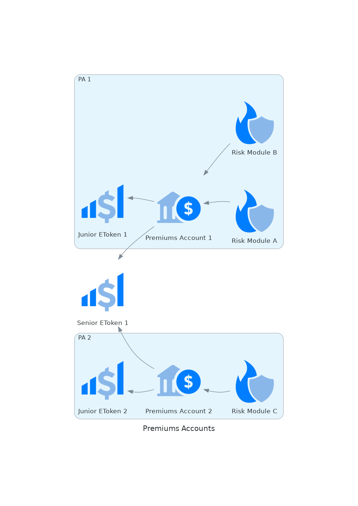

# Premiums Accounts

Every policy sold pays a premium; part of that premium is the pure premium. The losses for a sustainable insurance product should be less or equal to the pure premiums collected. This condition doesn't always need to be true, but it should be respected in the long term.

As the first source of capital to cover the losses, premiums are used up to their total exhaustion before accessing other capital sources (junior and senior eTokens).

Several kinds of risks coexist in Ensuro's protocol, often provided by different risk partners. For business and risk-related reasons, we don't want to mix all the premiums from these different sources. Consequently, the protocol has several _Premiums Accounts_ that separate the different premium streams, each account collecting the pure premiums from one or more risk modules.

On the solvency side, each Premiums Account might be linked to a junior eToken and a senior eToken, to back up the solvency needs when premiums are exhausted.

## Pure premiums

The _premiums account_ contract keeps track of the pure premiums in two concepts:

* **Active pure premiums**: the pure premiums of the active policies of the connected _risk modules_.
* **Surplus (or deficit)**: the accumulated result of the finalized policies, i.e., the pure premiums collected minus the losses paid. When positive, it's the _won pure premiums_ available to cover losses. When negative, it means the account used part of the active pure premiums (up to a limit, see below) to cover past losses.

For covering the losses of a payout, the precedence is:

1. _**Won pure premiums**_: the accumulated surplus from past finalized policies.
2. **Borrow from active premiums**: the pure premiums of active policies are used for payouts, up to a limit defined by the _deficit ratio_ (see below).
3. _**Junior eToken**_: takes an [internal loan](liquidity-pools.md#internal-loan) from the junior eToken, up to the _junior loan limit_.
4. _**Senior eToken**_: takes an [internal loan](liquidity-pools.md#internal-loan) from the senior eToken, up to the _senior loan limit_.

The contract tries each source of capital, going to the next one only if unable to cover the payout.

### Deficit ratio

The `deficitRatio` parameter indicates the proportion of the _active pure premiums_ that can be used to cover losses. Borrowing active premiums allows the account to cover losses before going to the eTokens, but it effectively postpones the impact of those losses to the liquidity providers.

This parameter depends on assumptions about the timing of the losses:

* In a portfolio where all the losses happen at the same time and close to the expiration, this ratio should be closer to zero, since the active premiums will soon be needed for the expiring policies.
* In portfolios where the triggered policies happen early, this parameter can be closer to 1.

### Loan limits

The `jrLoanLimit` and `srLoanLimit` parameters restrict how much the premiums account can borrow from the junior and senior eTokens, respectively. A value of zero means there's no limit.

## Loan repayment

Internal loans are **not** repaid automatically when policies expire. Instead, a separate `repayLoans` call must be made. It repays the outstanding debt using the premium surplus in excess of the allowed deficit, repaying the senior eToken first and then the junior eToken.

`repayLoans` is currently executed by permissioned operative accounts (with the `REPAY_LOANS_ROLE`), but it could in the future be opened to be executed by anyone.
