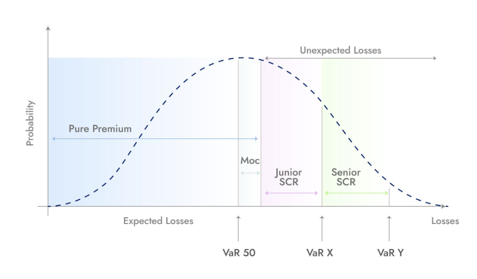

# Ensuro's Pools – Overview

[Ensuro](https://blog.ensuro.co/ensuro-2-0-is-here-df401555a65f) offers two risk tranches to Liquidity Providers.

The first tranche, the Junior Tranche, covers the losses immediately after pure premiums are exhausted. The Junior Tranche is linked to a specific partner, hence to a very specific set of risks. Covering the first risk corridor, after the expected losses corridor, it yields higher and riskier returns.

The second tranche, the Senior Tranche, comes into play only when the Junior Tranche is exhausted. The Senior Tranche can be exposed to several partners (Otonomi, Koala, and Spot), achieving greater diversification. Covering the second risk corridor of multiple partners, it yields lower and safer returns.

Each tranche has different returns according to the different levels of risk assumed, thus attracting different profiles of investors.

#### **What is the Senior Pool?**

The **Senior Pool** is Ensuro’s low-risk investment option for Liquidity Providers, offering exposure to a well-diversified portfolio of uncorrelated insurance programs. It serves as the last-resort solvency capital layer, stepping in only after the Junior Tranche has absorbed potential losses. Thanks to this structure, the Senior Pool benefits from high capital protection and stable returns.

In the period **May 2024 – May 2025**, the Senior Tranche delivered an **annualized return of 25.2%** and a **Sharpe ratio of 2.13**, indicating a good risk-adjusted performance. Risk is diversified across partners and product types (travel delays, cargo risks, cancel-for-any-reason), with no significant correlations between modules. This diversification is reinforced by Ensuro’s risk limits, which cap exposures by geography, seasonality, and other cluster-prone dimensions.

LPs in the Senior Pool benefit from high liquidity. Withdrawals can be made at any time, subject to pool availability. Even in stress scenarios, **80% of the capital is withdrawable in under three months**, and full recovery is achievable within one year. Ensuro maintains a \~90% liquidity pool utilization rate to ensure efficient capital deployment while preserving withdrawal flexibility.

#### **Risk Management**

Liquidity Providers are at the heart of Ensuro’s business model, providing the solvency capital that supports the insurance risk, i.e., that is used to repay unexpected losses. Ensuro makes a concentrated effort to guarantee the safety of LPs assets from an IT and a risk-management standpoint. The risk management comprises the following steps.

**Model Onboarding.** Risk models are vetted by Ensuro’s Quant team. The quantitative team estimates the pricing parameters and the program’s portfolio structure with the Risk Partner before the roll-out of the program. The quantitative team tries to strike the best possible balance between the safety of the investment, the returns for the Liquidity Providers, and the costs for the end customers.

**Real-Time Model Monitoring.** Once the program is live, the quantitative team tracks its dynamics in real time and applies sensitive interventions to adjust the pricing if the performance is not in line with expectations. The real-time visibility of the program allows Ensuro to carry out surgical and preventive actions rather than massive, a-posteriori revolutions.

**Architecture Shield.** Ensuro's architecture accesses four pools sequentially; the first two need to be completely drained before any loss can impact the third, where the LPs’ capital is stored. These pools are:

* Won Premium pool: this pool contains the pure premiums of all expired policies.
* Active Premium pool: this pool contains the pure premiums of all currently active policies.
* Junior SCR pool: this pool collects the Junior Tranche of solvency capital of the active policies. It represents the LPs’ capital deployed in the Junior Tranche.
* Senior SCR pool: this pool collects the Senior Tranche of solvency capital of the active policies. It represents the LPs’ capital deployed in the Senior Tranche.

Before disbursing the LPs’ capital locked in the SCR pool (Junior first and Senior later), both the Won Premium pool and the Active Premium pool must be fully depleted. As mentioned, policies are priced incorporating a conservative factor called 'margin of conservatism' or MoC. This parameter increases the pure premium having the effect of increasing both the Won and Active Premium pool, shielding the SCR pool. The MoC is monitored in real-time, and can be increased as deemed necessary.
