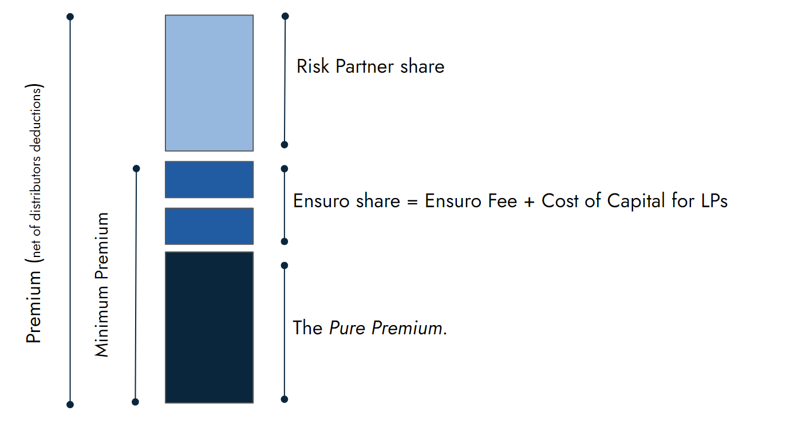
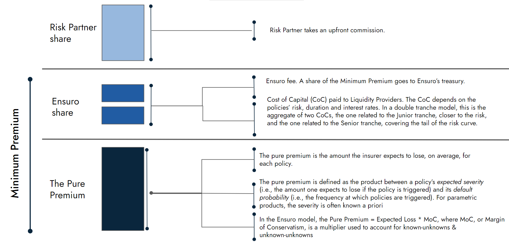
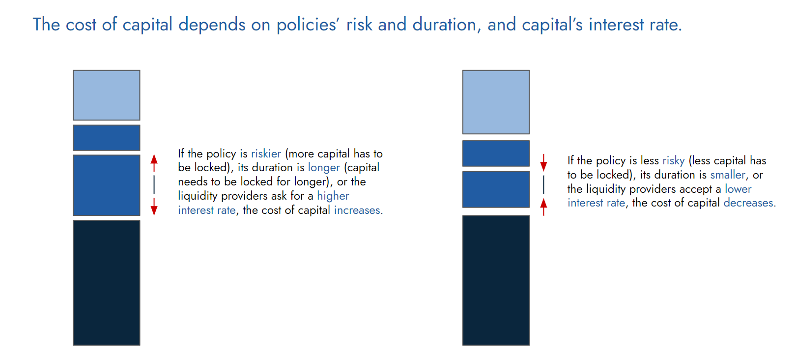
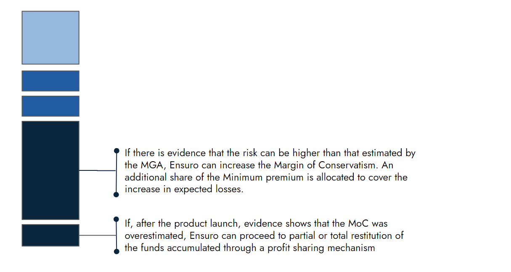

# Flow

## 1. Purchase of the product

* Users will acquire the product through the designated distribution channels of The Risk Partner, making direct payments in the currency chosen by the Risk Partner.

## 2. Conversion of USD to USDC and vice versa using Circle account

* Prior to program initiation, it is necessary for the Risk Partner to establish an account on the [Circle platform](https://www.circle.com/en/). Circle, the issuer of the USDC stablecoin, facilitates the conversion of USD to USDC. This process typically takes approximately three weeks to complete and entails fulfilling the KYB (Know-Your-Business) requirements akin to those of a traditional bank.

## 3. Retention of fees by the Risk Partner and transfer of Minimum Premium (in USDC) on the Polygon blockchain

* While user premiums are received in the currency chosen by the Risk Partner, Ensuro's commissions are payable in [USDC](https://www.circle.com/en/usdc). To accommodate the time required for stablecoin conversion, it is recommended that the Risk Partner initially deposit a specified amount of USDC into a wallet created on the [Polygon blockchain](https://polygon.technology/). The Ensuro team is available to provide assistance throughout this process.

Upon the sale of a policy, the following actions are taken by the Risk Partner:

* Upfront retention of commissions by the Risk Partner.
* Transfer of the following items to Ensuro:
* Policy details, including start date, expiration date, payout amount in USDC, and the probability of loss for the specific policy. These parameters enable Ensuro's system to calculate the Minimum Premium.
* Minimum Premium amount in USDC. To facilitate this, the Risk Partner must possess a wallet on the Polygon blockchain containing USDC. Opening a [Circle account](https://www.circle.com/en/circle-account), as mentioned earlier, is recommended, and the Ensuro team is prepared to assist with this process.

## Pricing breakdown

The Minimum Premium is what is transferred to Ensuro in order to lock the of solvency capital and activate each policy

## 4. Capital Locking for Reimbursement Guarantee by Ensuro

Ensuro undertakes the crucial step of locking capital to ensure the seamless fulfillment of reimbursement payments.

The cost of capital is intricately tied to the risk level and duration of policies, as well as the prevailing interest rates applicable to the locked capital.

When policies entail higher risks, necessitating the locking of a greater amount of capital, or when the duration of the policies is longer, thereby requiring a lengthier period of capital locking, the cost of capital increases. Similarly, if liquidity providers demand a higher interest rate, it further contributes to the overall cost of capital.

Conversely, policies characterized by lower risk levels, requiring a smaller capital lock, or featuring shorter durations, can result in a decrease in the cost of capital. Additionally, if liquidity providers are amenable to accepting a lower interest rate, it can further mitigate the cost of capital.

Ensuro diligently assesses these factors to ascertain an appropriate cost of capital that aligns with the specific risk profiles and durations of policies, while taking into account the prevailing interest rate demands of liquidity providers.

## 5. Implementation of Trigger Mechanism using Blockchain Oracle:

Once an agreement is reached with the Risk Partner, Ensuro proceeds to establish on-chain conditions for policy triggers. This mechanism can be customized for each individual policy, allowing for precise and transparent execution.

## 6. Payout Transfer to Risk Partner's Wallet on the Polygon Blockchai

In the event of a payout, Ensuro promptly transfers the agreed-upon amount in USDC (a stablecoin) to the wallet from which the Risk Partner originally submitted the policy. This transfer occurs within seconds of the trigger event, leveraging the efficiency of blockchain technology. The settlement process is nearly instantaneous, ensuring swift and seamless payment disbursement.

## 7. User Receives Payout in Fiat Currency

The Risk Partner assumes responsibility for facilitating the conversion from USDC stablecoins to the fiat currency of their choice. They arrange for the payout to be directly settled with the users in their preferred currency. In cases where a reinsurance agreement is in effect, the Risk Partner may include any recoveries owed in the payout from Ensuro, streamlining the overall settlement process.

## 8. Profit sharing

If the performance of the portfolio of policies, is better than forecast at the beginning of the program, Ensuro will redistribute to the Risk Partner a share of the residual profit in accordance with pre-agreed terms.

Conversely, should the performance of the portfolio be worse than expected, Ensuro will re-discuss the pricing, potentially increasing the Margin of Conservatism and consequently the Minimum Premium.

