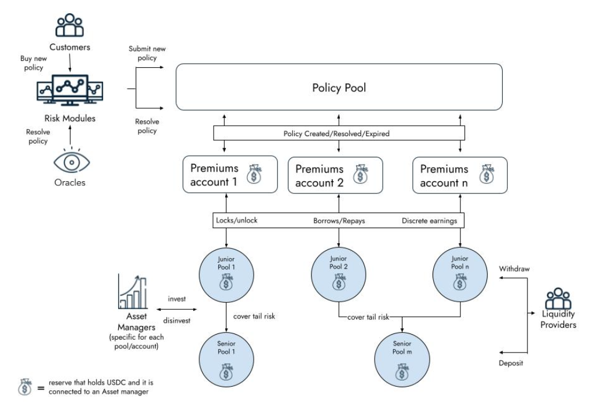

# Architecture

Ensuro smart contracts are coded in Solidity, and the codebase is [open-source](https://github.com/ensuro/ensuro).

You can find more details about the underlying design on [our whitepaper](https://ensuro.co/Ensuro_whitepaper.pdf).

## Architecture

## Contracts

The protocol comprises several smart contracts, some unique for each instance of the protocol, while others can have multiple instances.

Here's a brief description of the contracts.

### PolicyPool

PolicyPool is the protocol's main contract. It keeps track of active policies and receives spending allowances. It has methods for LP to deposit/withdraw, acting as a gateway. The PolicyPool is connected to a set of eTokens, Premiums Accounts, and RiskModules. This contract also follows the ERC721 standard, minting an NFT for each policy created. The owner of the NFT is who will receive the payout in case there's any.

### AccessManager

This contract the access control permissions for the governance actions.

### EToken

EToken is an ERC20-compatible contract that counts the capital of each liquidity provider in a given pool. The valuation is one-to-one with the underlying stablecoin. The view `scr()` returns the amount of capital that's locked backing up policies. For this capital locked, the pool receives an interest (see `scrInterestRate()` and `tokenInterestRate()`) that is continuously accrued in the balance of eToken holders.

### RiskModule

This base contract allows risk partners and customers to interact with the protocol. It needs to be reimplemented for each different product, each time defining the proper policy parameters, price validation, and policy resolution strategy (e.g., using oracles). RiskModule must be called to create a new policy; after validating the price and storing parameters needed for resolution, RiskModule submits the policy to PolicyPool.

### PremiumsAccount

The risk modules are grouped in premiums accounts that keep track of their policies' pure premiums (active and earned). The responsibility of these contracts is to keep track of the premiums and release the payouts. When premiums are exhausted (losses more than expected), they borrow money from the eTokens to cover the payouts. This money will be repaid when/if later the premiums account has a surplus (losses less than expected).

### AssetManager

Both _eTokens_ and _PremiumsAccounts_ are _reserves_ because they hold assets. It's possible to assign to each reserve an AssetManager. The AssetManager is a contract that operates in the reserve's context (through delegatecalls) and manages the assets by applying some strategy to invest in other DeFi protocols to generate additional returns.

### LPWhitelist

This is an optional component. If present it controls which Liquidity Providers can deposit or transfer their _eTokens_. Each eToken may be or not connected to a whitelist.

### Policy

Policy is a library with the struct and the calculation of relevant attributes of a policy. It includes the logic around the premium distribution, SCR calculation, shared coverage, and other protocol behaviors.
