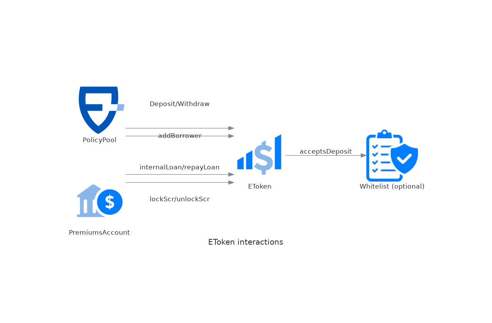

# EToken

This is an ERC20 compatible contract that represents the capital of each liquidity provider in a given pool. The valuation is one-to-one with the underlying stablecoin. The view `scr()` returns the amount of capital that's locked backing up policies. For this capital locked, the pool receives an interest (scrInterestRate() / tokenInterestRate()) that is continuously accrued in the balance of eToken holders. [See more](../liquidity-pools.md).

## **Roles**

The specific roles and functions of the contract are as follows:

| Role | Global* | Description | Methods Accessible |
| --- | --- | --- | --- |
| LEVEL1_ROLE | ✓ | High impact changes like upgrades or other critical operations. | [setAssetManager](etoken.md#setassetmanager): Implements the asset management strategy<br>setWhiteList: Set the contract used for whitelisting LPs |
| LEVEL2_ROLE | ✓ | Mid-impact changes like changing some parameters. | [forwardToAssetManager](etoken.md#forwardtoassetmanager): Call custom functions of the asset manager (for example for setting parameters)<br>[setParam](etoken.md#setting-parameters): Set parameters. |
| LEVEL3_ROLE | ✓ | Low-impact changes like changing some parameters up to given percentage (tweaks). | [setParam](etoken.md#setting-parameters): Set parameters. |
| GUARDIAN_ROLE | ✓ | For emergency operations oriented to protect the protocol in case of attacks or hacking. | [setAssetManager](etoken.md#setassetmanager): Implements the asset management strategy<br>setWhiteList: Set the contract used for whitelisting LPs |

( \* ) Global means that the role can be delegated to a user at the protocol level (for all components) or only for a specific component. Non-global roles can only be granted for a specific component.

## Interactions



## Parameters

| Field                    | Type                    | Description                                                                                                                  |
| ------------------------ | ----------------------- | ---------------------------------------------------------------------------------------------------------------------------- |
| liquidityRequirement     | uint256 (wad)           | Usually 1.0, used on [withdrawal](../liquidity-pools.md#withdrawal) to scale the scr locked.                                 |
| minUtilizationRatio      | uint256 (wad)           | Used to prevent [deposits](../liquidity-pools.md#deposit) to overdilute the returns.                                         |
| maxUtilizationRatio      | uint256 (wad)           | Prevents taking [locking scr](../liquidity-pools.md#lock) (taking new policies) if utilization ratio exceeds this parameter. |
| internalLoanInterestRate | uint256 (wad)           | Interest rate charged for [internal loans](../liquidity-pools.md#internal-loan).                                             |
| whitelist                | address (ILPWhitelist)  | Optional contract that, if present, controls who can deposit funds in the eToken. See [ILPWhitelist](ilpwhitelist/overview.md).         |
| assetManager             | address (IAssetManager) | Optional contract that, if present, implements the asset management strategy. See [IAssetManager](iassetmanager/overview.md).           |

### Packed parameters

To save gas, the parameters are stored in a packed struct that fits in 256bits (a _word_ in the EVM). This is not visible externally, but put's limits on the precision of the parameters. The _wad_ ones, have 4 decimals as precision, so 1.12345 will be truncated to 1.1234.

## Events

### SCRLocked

```solidity
event SCRLocked(uint256 interestRate, uint256 value)
```

Event emitted when part of the funds of the eToken are locked as solvency capital.

| Name         | Type    | Description                                            |
| ------------ | ------- | ------------------------------------------------------ |
| interestRate | uint256 | The annualized interestRate paid for the capital (wad) |
| value        | uint256 | The amount locked                                      |

### SCRUnlocked

```solidity
event SCRUnlocked(uint256 interestRate, uint256 value)
```

Event emitted when the locked funds are unlocked and no longer used as solvency capital.

| Name         | Type    | Description                                                     |
| ------------ | ------- | --------------------------------------------------------------- |
| interestRate | uint256 | The annualized interestRate that was paid for the capital (wad) |
| value        | uint256 | The amount unlocked                                             |

### Transfer

```solidity
event Transfer(address indexed from, address indexed to, uint256 value)
```

Event emitted when `value` tokens are moved from one account (`from`) to another (`to`).

| Name  | Type    | Description                                                |
| ----- | ------- | ---------------------------------------------------------- |
| from  | address | The current owner of the token.                            |
| to    | address | The destination of the tokens if the transfer is accepted. |
| value | uint256 | TThe amount of tokens to be transferred.                   |

### InternalLoan

```solidity
event InternalLoan(address indexed borrower, uint256 value, uint256 amountAsked)
```

Event emitted when PremiumsAccount borrow money from the eTokens to cover the payouts.

| Name        | Type    | Description                    |
| ----------- | ------- | ------------------------------ |
| borrower    | address | The address of the _borrower_. |
| value       | uint256 | The amount to borrow.          |
| amountAsked | uint256 | The amount asked to borrow.    |

### InternalLoanRepaid

```solidity
event InternalLoanRepaid(address indexed borrower, uint256 value)
```

Event emitted when the premiums account has a surplus (losses less than expected) and repay to eTokens.

| Name     | Type    | Description                    |
| -------- | ------- | ------------------------------ |
| borrower | address | The address of the _borrower_. |
| value    | uint256 | The amount to repay.           |

### InternalBorrowerAdded

```solidity
event InternalBorrowerAdded(address indexed borrower)
```

Event emitted when PolicyPool adds an authorized _borrower_ to the eToken.

| Name     | Type    | Description                    |
| -------- | ------- | ------------------------------ |
| borrower | address | The address of the _borrower_. |

### InternalBorrowerRemoved

```solidity
event InternalBorrowerRemoved(address indexed borrower, uint256 defaultedDebt)
```

Event emitted when PolicyPool removes an authorized _borrower_ to the eToken.

| Name          | Type    | Description                        |
| ------------- | ------- | ---------------------------------- |
| borrower      | address | The address of the _borrower_.     |
| defaultedDebt | uint256 | The amount debt of the _borrower_. |

## External Methods

### deposit

```solidity
function deposit(address provider, uint256 amount) external returns (uint256)
```

Registers a deposit of liquidity in the pool. Called from the PolicyPool, assumes the amount has already been transferred. `amount` of eToken are minted and given to the provider in exchange of the liquidity provided.

Requirements:

* Must be called by `policyPool()`
* The amount was transferred
* `utilizationRate()` after the deposit is >= `minUtilizationRate()`

Events:

* Emits {Transfer} with `from` = 0x0 and to = `provider`

| Name     | Type    | Description                           |
| -------- | ------- | ------------------------------------- |
| provider | address | The address of the liquidity provider |
| amount   | uint256 | The amount deposited.                 |

| Name | Type    | Description                        |
| ---- | ------- | ---------------------------------- |
| \[0] | uint256 | The actual balance of the provider |

### withdraw

```solidity
function withdraw(address provider, uint256 amount) external returns (uint256 withdrawn)
```

Withdraws an amount from an eToken. `withdrawn` eTokens are be burned and the user receives the same amount in `currency()`. If the asked `amount` can't be withdrawn, it withdraws as much as possible

Requirements:

* Must be called by `policyPool()`

Events:

* Emits {Transfer} with `from` = `provider` and to = `0x0`

| Name     | Type    | Description                                                                                         |
| -------- | ------- | --------------------------------------------------------------------------------------------------- |
| provider | address | The address of the liquidity provider                                                               |
| amount   | uint256 | The amount to withdraw. If `amount` == `type(uint256).max`, then tries to withdraw all the balance. |

| Name      | Type    | Description                                                                                 |
| --------- | ------- | ------------------------------------------------------------------------------------------- |
| withdrawn | uint256 | The actual amount that withdrawn. `withdrawn <= amount && withdrawn <= balanceOf(provider)` |

### addBorrower

```solidity
function addBorrower(address borrower) external
```

Adds an authorized _borrower_ to the eToken. This _borrower_ will be allowed to lock/unlock funds and to take loans.

Requirements:

* Must be called by `policyPool()`

Events:

* Emits {InternalBorrowerAdded}

| Name     | Type    | Description                                                                                       |
| -------- | ------- | ------------------------------------------------------------------------------------------------- |
| borrower | address | The address of the _borrower_, a PremiumsAccount that has this eToken as senior or junior eToken. |

### removeBorrower

```solidity
function removeBorrower(address borrower) external
```

Removes an authorized _borrower_ to the eToken. The _borrower_ can't no longer lock funds or take loans.

Requirements:

* Must be called by `policyPool()`

Events:

* Emits {InternalBorrowerRemoved} with the defaulted debt

| Name     | Type    | Description                                                                                       |
| -------- | ------- | ------------------------------------------------------------------------------------------------- |
| borrower | address | The address of the _borrower_, a PremiumsAccount that has this eToken as senior or junior eToken. |

### scr

```solidity
function scr() external view returns (uint256)
```

Returns the amount of capital that's locked as solvency capital for active policies.

### lockScr

```solidity
function lockScr(uint256 scrAmount, uint256 policyInterestRate) external
```

Locks part of the liquidity of the EToken as solvency capital.

Requirements:

* Must be called by a _borrower_ previously added with `addBorrower`.
* `scrAmount` <= `fundsAvailableToLock()`

Events:

* Emits {SCRLocked}

| Name               | Type    | Description                                                       |
| ------------------ | ------- | ----------------------------------------------------------------- |
| scrAmount          | uint256 | The amount to lock                                                |
| policyInterestRate | uint256 | The annualized interest rate (wad) to be paid for the `scrAmount` |

### unlockScr

```solidity
function unlockScr(uint256 scrAmount, uint256 policyInterestRate, int256 adjustment) external
```

Unlocks solvency capital previously locked with `lockScr`. The capital no longer needed as solvency.

Requirements:

* Must be called by a _borrower_ previously added with `addBorrower`.
* `scrAmount <= scr()`

Events:

* Emits {SCRUnlocked}

| Name               | Type    | Description                                                                                                       |
| ------------------ | ------- | ----------------------------------------------------------------------------------------------------------------- |
| scrAmount          | uint256 | The amount to unlock                                                                                              |
| policyInterestRate | uint256 | The annualized interest rate that was paid for the `scrAmount`, must be the same that was sent in `lockScr` call. |
| adjustment         | int256  |                                                                                                                   |

### internalLoan

```solidity
function internalLoan(uint256 amount, address receiver, bool fromAvailable) external returns (uint256)
```

Lends `amount` to the borrower (msg.sender), transferring the money to `receiver`. This reduces the `totalSupply()` of the eToken, and stores a debt that will be repaid (hopefully) with `repayLoan`.

Requirements:

* Must be called by a _borrower_ previously added with `addBorrower`.

Events:

* Emits {InternalLoan}
* Emits {ERC20-Transfer} transferring `lent` to `receiver`

| Name          | Type    | Description                                                                                                                                                                  |
| ------------- | ------- | ---------------------------------------------------------------------------------------------------------------------------------------------------------------------------- |
| amount        | uint256 | The amount required                                                                                                                                                          |
| receiver      | address | The received of the funds lent. This is usually the policyholder if the loan is used for a payout.                                                                           |
| fromAvailable | bool    | If `true`, the funds that can be lent are only the available ones, i.e., excluding the funds locked as `scr()`. If `false`, all the `totalSupply()` is available to be lent. |

| Name | Type    | Description                                                    |
| ---- | ------- | -------------------------------------------------------------- |
| \[0] | uint256 | Returns the amount that wasn't able to fulfil. `amount - lent` |

### repayLoan

```solidity
function repayLoan(uint256 amount, address onBehalfOf) external
```

Repays a loan taken with `internalLoan`.

Requirements:

* `msg.sender` approved the spending of `currency()` for at least `amount`

Events:

* Emits {InternalLoanRepaid}
* Emits {ERC20-Transfer} transferring `amount` from `msg.sender` to `this`

| Name       | Type    | Description                                                                                                                                                              |
| ---------- | ------- | ------------------------------------------------------------------------------------------------------------------------------------------------------------------------ |
| amount     | uint256 | The amount to repaid, that will be transferred from `msg.sender` balance.                                                                                                |
| onBehalfOf | address | The address of the borrower that took the loan. Usually `onBehalfOf == msg.sender` but we keep it open because in some cases with might need someone else pays the debt. |

### getLoan

```solidity
function getLoan(address borrower) external view returns (uint256)
```

Returns the updated debt (principal + interest) of the `borrower`.

### Setting parameters

Usually, **LEVEL2\_ROLE** or **LEVEL3\_ROLE** is requested for performing operations that change numerical parameters of the components. Both global and component role are accepted. If the user has **LEVEL3\_ROLE** the changes might be restricted to small tweaks.

## Inherited from Reserve

### assetManager

```solidity
function assetManager() public view virtual returns (contract IAssetManager)
```

Returns the address of the asset manager for this reserve. The asset manager is the contract that manages the funds to generate additional yields. Can be `address(0)` if no asset manager has been set.

### setAssetManager

```solidity
function setAssetManager(contract IAssetManager newAM, bool force) external
```

Sets the asset manager for this reserve. If the reserve had previously an asset manager, it will deinvest all the funds, making all of the liquid in the reserve balance.

Requirements:

* The caller must have been granted of global or component roles GUARDIAN\_ROLE or LEVEL1\_ROLE.

Events:

* Emits ComponentChanged with action setAssetManager or setAssetManagerForced

| Name  | Type                   | Description                                                                                                                                                                                                                        |
| ----- | ---------------------- | ---------------------------------------------------------------------------------------------------------------------------------------------------------------------------------------------------------------------------------- |
| newAM | contract IAssetManager | The address of the new asset manager to assign to the reserve. If is `address(0)` it means the reserve will not have an asset manager. If not `address(0)` it MUST be a contract following the IAssetManager interface.            |
| force | bool                   | When a previous asset manager exists, before setting the new one, the funds are deinvested. When `force` is true, an error in the deinvestAll() operation is ignored. When `force` is false, if `deinvestAll()` fails, it reverts. |

### rebalance

```solidity
function rebalance() public
```

Calls {IAssetManager-rebalance} of the assigned asset manager (fails if no asset manager). This operation is intended to give the opportunity to rebalance the liquid and invested for better returns and/or gas optimization.

* Emits {IAssetManager-MoneyInvested} or {IAssetManager-MoneyDeinvested}

### recordEarnings

```solidity
function recordEarnings() public
```

Calls {IAssetManager-recordEarnings} of the assigned asset manager (fails if no asset manager). The asset manager will return the earnings since last time the earnings where recorded. It then calls `_assetEarnings` to reflect the earnings in the way defined for each reserve.

* Emits {IAssetManager-EarningsRecorded}

### checkpoint

```solidity
function checkpoint() external
```

Function that calls both `recordEarnings()` and `rebalance()` (in that order). Usually scheduled to run once a day by a keeper or crontask.

### forwardToAssetManager

```solidity
function forwardToAssetManager(bytes functionCall) external returns (bytes)
```

This function allows to call custom functions of the asset manager (for example for setting parameters). This functions will be called with `delegatecall`, in the context of the reserve.

Requirements:

* The caller must have been granted of global or component roles LEVEL2_ROLE._

| Name         | Type  | Description                        |
| ------------ | ----- | ---------------------------------- |
| functionCall | bytes | Abi encoded function call to make. |

| Name | Type  | Description                                                                     |
| ---- | ----- | ------------------------------------------------------------------------------- |
| \[0] | bytes | Returns the return value of the function called, to be decoded by the receiver. |

###
