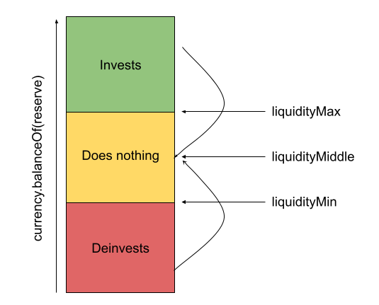

# LiquidityThresholdAssetManager

This is an abstract implementation of the [IAssetManager](overview.md) interface that implements a liquidity strategy based on thresholds.

This strategy manages how much of the funds should remain liquid in the reserve (`currency().balanceOf(reserve)`) and how much is invested. For that, it has three liquidity thresholds: minimum, middle, and maximum. On the rebalance operations, if the liquid funds of the reserve are above the maximum, it invests funds, leaving liquidity at the middle level. If the liquid funds are below the minimum, it deinvests enough funds to leave the liquidity again at the middle level.



## Inheriting

The contract does not implement the specific investment strategy, that must be implemented by descendant contracts. These contracts must overload at least the functions `_invest(amount)`, `_deinvest(amount),` `deinvestAll()`, and `getInvestmentValue()`.

## Parameters

| Field           | Type             | Description                                                                                                     |
| --------------- | ---------------- | --------------------------------------------------------------------------------------------------------------- |
| liquidityMin    | uint256 (amount) | Minimal amount of liquid funds the Asset Manager tries to leave in the Reserve. If under this value, deinvests. |
| liquidityMiddle | uint256 (amount) | Target amount to which the liquid funds of the reserve are taken after a rebalance operation                    |
| liquidityMin    | uint256 (amount) | Maximum amount of liquid funds the Asset Manager tries to leave in the Reserve. If above this value, invests.   |

## External Methods

### setLiquidityThresholds

```solidity
function setLiquidityThresholds(uint256 min, uint256 middle, uint256 max) external
```

| Name   | Type    | Description                                                               |
| ------ | ------- | ------------------------------------------------------------------------- |
| min    | uint256 | The new value for liquidityMin or type(uint256).max to leave unchanged    |
| middle | uint256 | The new value for liquidityMiddle or type(uint256).max to leave unchanged |
| max    | uint256 | The new value for liquidityMax or type(uint256).max to leave unchanged    |
