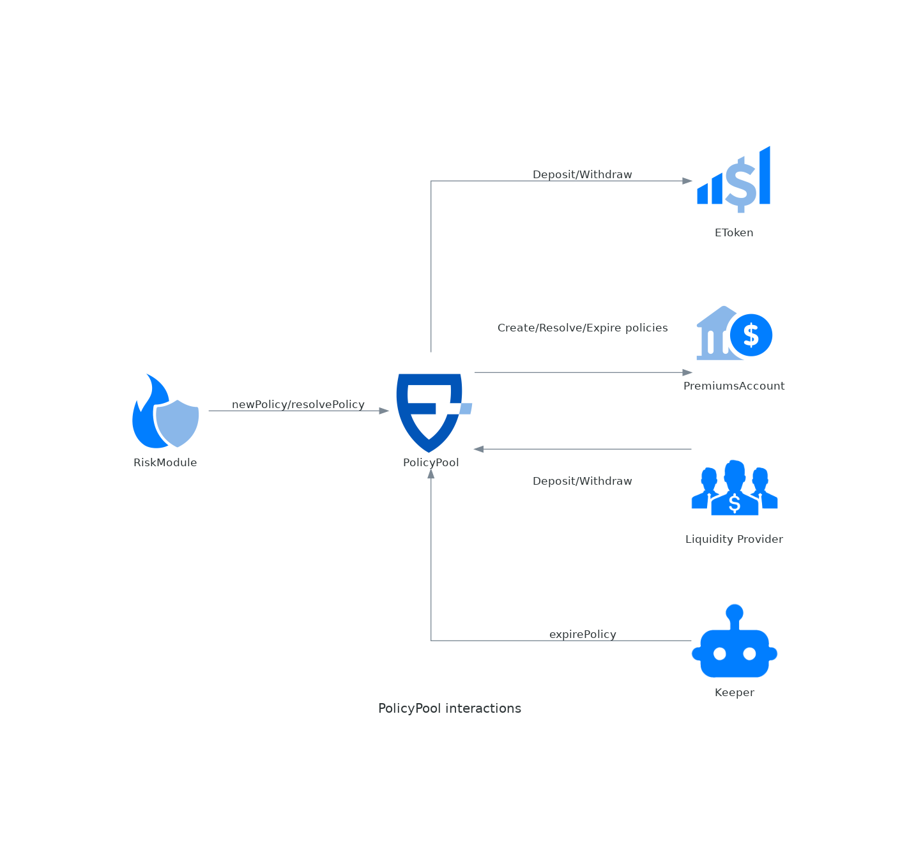

# PolicyPool

The PolicyPool is the main contract that keeps track of active policies and receives the spending allowances. It's a single PolicyPool for each instance of the protocol. One of its attributes is `currency()`, which points to the coin (ERC20) used throughout the protocol. So far we support only USDC as currency.

It has methods for LP to deposit/withdraw, acting as a gateway for the eTokens. The PolicyPool is connected to a set of [eTokens](etoken.md), [premiums accounts](premiumsaccount.md), and [risk modules](riskmodule.md).

This contract also follows the ERC721 standard, minting an NFT for each policy created. The owner of the NFT is who will receive the payout in case there's any.

## **Roles**

The roles and functions of the contract are as follows:

| Role | Description | Methods Accessible |
| --- | --- | --- |
| LEVEL1_ROLE | High impact changes like upgrades or other critical operations | addComponent: Adds a new component to the protocol.<br>removeComponent: Removes a component from the protocol.<br>changeComponentStatus: Change the status of a componenent.<br>setTreasury: Changes the treasury address.<br>unpause: Unpauses the smart contract. |
| LEVEL2_ROLE | Mid-impact changes like changing some parameters. | setBaseURI: Changes the base URI of policy NFTs. |
| GUARDIAN_ROLE | For emergency operations oriented to protect the protocol in case of attacks or hacking. | changeComponentStatus: Changes the status of a component. |

## Interactions



## Parameters

| Field    | Type    | Description                                                                                                                                      |
| -------- | ------- | ------------------------------------------------------------------------------------------------------------------------------------------------ |
| treasury | address | This is the address of the Ensuro Treasury, that receives the protocol fees (see [#ensuro-commission](../policy.md#ensuro-commission "mention")) |

## Policy database

One of the responsibilities of the PolicyPool contract is to keep track of active policies with all the (immutable) data.

Given the [Policy](../policy.md) struct has many fields and storage is expensive on-chain, the struct isn't stored as a storage variable of the contracts.

Instead, when the policy is created, only a hash of the struct is stored and an event with all the fields is emitted. Then, for any operation with the Policy (like resolution or expiration), all the policy needs to be sent as a parameter. The PolicyPool contract computes the hash of the parameter and compares it with the stored one.

The mapping from policyId to hash is stored in the `_policies` attribute.

## Events

### NewPolicy

```solidity
event NewPolicy(contract IRiskModule riskModule, struct Policy.PolicyData policy)
```

Event emitted every time a new policy is added to the pool. Contains all the data about the policy that is later required for doing operations with the policy like resolution or expiration.

| Name       | Type                     | Description                                                                                 |
| ---------- | ------------------------ | ------------------------------------------------------------------------------------------- |
| riskModule | contract IRiskModule     | The risk module that created the policy                                                     |
| policy     | struct Policy.PolicyData | The [{Policy-PolicyData}](../policy.md) struct with all the immutable fields of the policy. |

### PolicyResolved

```solidity
event PolicyResolved(contract IRiskModule riskModule, uint256 policyId, uint256 payout)
```

Event emitted every time a policy is removed from the pool. If the policy expired, the `payout` is 0, otherwise is the amount transferred to the policyholder.

| Name       | Type                 | Description                                                                    |
| ---------- | -------------------- | ------------------------------------------------------------------------------ |
| riskModule | contract IRiskModule | The risk module where that created the policy initially.                       |
| policyId   | uint256              | The unique id of the policy                                                    |
| payout     | uint256              | The payout that has been paid to the policy holder. 0 when the policy expired. |

### ComponentChanged

```solidity
event ComponentChanged(enum IAccessManager.GovernanceActions action, address value)
```

Event emitted when the treasury changes.

| Name   | Type                                  | Description                                                               |
| ------ | ------------------------------------- | ------------------------------------------------------------------------- |
| action | enum IAccessManager.GovernanceActions | The type of governance action (just setTreasury in this contract for now) |
| value  | address                               | The address of the new treasury                                           |

### ComponentStatusChanged

```solidity
event ComponentStatusChanged(contract IPolicyPoolComponent component, enum PolicyPool.ComponentKind kind, enum PolicyPool.ComponentStatus newStatus)
```

Event emitted when a new component added/removed to the pool or the status changes.

| Name      | Type                            | Description                                                                            |
| --------- | ------------------------------- | -------------------------------------------------------------------------------------- |
| component | contract IPolicyPoolComponent   | The address of the component, it can be an {EToken}, {RiskModule} or {PremiumsAccount} |
| kind      | enum PolicyPool.ComponentKind   | Value indicating the kind of component. See {ComponentKind}                            |
| newStatus | enum PolicyPool.ComponentStatus | The status of the component after the operation. See {ComponentStatus}                 |

## External Methods

### newPolicy

```solidity
function newPolicy(struct Policy.PolicyData policy, address caller, address policyHolder, uint96 internalId) external returns (uint256)
```

Creates a new Policy. Must be called from an active RiskModule

Requirements:

* `msg.sender` must be an active RiskModule
* `caller` approved the spending of `currency()` for at least `policy.premium`
* `internalId` must be unique within `policy.riskModule` and not used before

Events:

* {PolicyPool-NewPolicy}: with all the details about the policy
* {ERC20-Transfer}: does several transfers from caller address to the different receivers of the premium (see Premium Split in the docs)

| Name         | Type                     | Description                                                                   |
| ------------ | ------------------------ | ----------------------------------------------------------------------------- |
| policy       | struct Policy.PolicyData | A policy created with {Policy-initialize}                                     |
| caller       | address                  | The pricer that's creating the policy and will pay for the premium            |
| policyHolder | address                  | The address of the policy holder and the payer of the premiums                |
| internalId   | uint96                   | A unique id within the RiskModule, that will be used to compute the policy id |

| Name | Type    | Description                                       |
| ---- | ------- | ------------------------------------------------- |
| \[0] | uint256 | The policy id, identifying the NFT and the policy |

### resolvePolicy

```solidity
function resolvePolicy(struct Policy.PolicyData policy, uint256 payout) external
```

Resolves a policy with a payout. Must be called from an active RiskModule

Requirements:

* `policy`: must be a Policy previously created with `newPolicy` (checked with `policy.hash()`) and not resolved before and not expired (if `payout > 0`).
* `payout`: must be less than equal to `policy.payout`.

Events:

* {PolicyPool-PolicyResolved}: with the payout
* {ERC20-Transfer}: to the policyholder with the payout

| Name   | Type                     | Description                                  |
| ------ | ------------------------ | -------------------------------------------- |
| policy | struct Policy.PolicyData | A policy previously created with `newPolicy` |
| payout | uint256                  | The amount to paid to the policyholder       |

### resolvePolicyFullPayout

```solidity
function resolvePolicyFullPayout(struct Policy.PolicyData policy, bool customerWon) external
```

Resolves a policy with a payout that can be either 0 or the maximum payout of the policy

Requirements:

* `policy`: must be a Policy previously created with `newPolicy` (checked with `policy.hash()`) and not resolved before and not expired (if customerWon).

Events:

* {PolicyPool-PolicyResolved}: with the payout
* {ERC20-Transfer}: to the policyholder with the payout

| Name        | Type                     | Description                                           |
| ----------- | ------------------------ | ----------------------------------------------------- |
| policy      | struct Policy.PolicyData | A policy previously created with `newPolicy`          |
| customerWon | bool                     | Indicated if the payout is zero or the maximum payout |

### expirePolicy

```solidity
function expirePolicy(struct Policy.PolicyData policy) external
```

Resolves a policy with a payout 0, unlocking the solvency. Can be called by anyone, but only after `Policy.expiration`.

Requirements:

* `policy`: must be a Policy previously created with `newPolicy` (checked with `policy.hash()`) and not resolved before
* Policy expired: `Policy.expiration` <= block.timestamp

Events:

* {PolicyPool-PolicyResolved}: with payout == 0

| Name   | Type                     | Description                                  |
| ------ | ------------------------ | -------------------------------------------- |
| policy | struct Policy.PolicyData | A policy previously created with `newPolicy` |

### deposit

```solidity
function deposit(contract IEToken eToken, uint256 amount) external
```

Deposits liquidity into an eToken. Forwards the call to {EToken-deposit}, after transferring the funds. The user will receive etokens for the same amount deposited.

Requirements:

* `msg.sender` approved the spending of `currency()` for at least `amount`
* `eToken` is an active eToken installed in the pool.

Events:

* {EToken-Transfer}: from 0x0 to `msg.sender`, reflects the eTokens minted.
* {ERC20-Transfer}: from `msg.sender` to address(eToken)

| Name   | Type             | Description                                                            |
| ------ | ---------------- | ---------------------------------------------------------------------- |
| eToken | contract IEToken | The address of the eToken to which the user wants to provide liquidity |
| amount | uint256          | The amount to deposit                                                  |

### withdraw

```solidity
function withdraw(contract IEToken eToken, uint256 amount) external returns (uint256)
```

Withdraws an amount from an eToken. Forwards the call to {EToken-withdraw}. `amount` of eTokens will be burned and the user will receive the same amount in `currency()`.

Requirements:

* `eToken` is an active (or deprecated) eToken installed in the pool.

Events:

* {EToken-Transfer}: from `msg.sender` to `0x0`, reflects the eTokens burned.
* {ERC20-Transfer}: from address(eToken) to `msg.sender`

| Name   | Type             | Description                                                                                                                                                                                          |
| ------ | ---------------- | ---------------------------------------------------------------------------------------------------------------------------------------------------------------------------------------------------- |
| eToken | contract IEToken | The address of the eToken from where the user wants to withdraw liquidity                                                                                                                            |
| amount | uint256          | The amount to withdraw. If equal to type(uint256).max, means full withdrawal. If the balance is not enough or can't be withdrawn (locked as SCR), it withdraws as much as it can, but doesn't fails. |

| Name | Type    | Description                          |
| ---- | ------- | ------------------------------------ |
| \[0] | uint256 | Returns the actual amount withdrawn. |

### access

```solidity
function access() external view virtual returns (contract IAccessManager)
```

Reference to the {AccessManager} contract, this contract manages the access controls.

| Name | Type                    | Description                               |
| ---- | ----------------------- | ----------------------------------------- |
| \[0] | contract IAccessManager | The address of the AccessManager contract |

### currency

```solidity
function currency() external view virtual returns (contract IERC20Metadata)
```

Reference to the main currency (ERC20) used in the protocol

| Name | Type                    | Description                                                        |
| ---- | ----------------------- | ------------------------------------------------------------------ |
| \[0] | contract IERC20Metadata | The address of the currency (e.g. USDC) token used in the protocol |

### treasury

```solidity
function treasury() external view returns (address)
```

Returns the address of the treasury, the one that receives the protocol fees.

### Others

### addComponent

```solidity
function addComponent(contract IPolicyPoolComponent component, enum PolicyPool.ComponentKind kind) external
```

Adds a new component (either an {EToken}, {RiskModule} or {PremiumsAccount}) to the protocol. The component status will be `active`.

Requirements:

* Must be called by a user with the {LEVEL1\_ROLE}
* The component wasn't added before.

Events:

* Emits {ComponentStatusChanged} with status active.

| Name      | Type                          | Description                                                                                                                                                                            |
| --------- | ----------------------------- | -------------------------------------------------------------------------------------------------------------------------------------------------------------------------------------- |
| component | contract IPolicyPoolComponent | The address of component contract. Must be an {EToken}, {RiskModule} or {PremiumsAccount} linked to this specific {PolicyPool} and matching the `kind` specified in the next paramter. |
| kind      | enum PolicyPool.ComponentKind | The type of component to be added.                                                                                                                                                     |

### removeComponent

```solidity
function removeComponent(contract IPolicyPoolComponent component) external
```

Removes a component from the protocol. The component needs to be in `deprecated` status before doing this operation.

Requirements:

* Must be called by a user with the {LEVEL1\_ROLE}
* The component status is `deprecated`.

Events:

* Emits {ComponentStatusChanged} with status inactive.

| Name      | Type                          | Description                                                          |
| --------- | ----------------------------- | -------------------------------------------------------------------- |
| component | contract IPolicyPoolComponent | The address of component contract. Must be a component added before. |

### changeComponentStatus

```solidity
function changeComponentStatus(contract IPolicyPoolComponent component, enum PolicyPool.ComponentStatus newStatus) external
```

Changes the status of a component.

Requirements:

* Must be called by a user with the {LEVEL1\_ROLE} if the new status is `active` or `deprecated`.
* Must be called by a user with the {GUARDIAN\_ROLE} if the new status is `suspended`.

Events:

* Emits {ComponentStatusChanged} with the new status.

| Name      | Type                            | Description                                                           |
| --------- | ------------------------------- | --------------------------------------------------------------------- |
| component | contract IPolicyPoolComponent   | The address of component contract. Must be a component added before.  |
| newStatus | enum PolicyPool.ComponentStatus | The new status, must be either `active`, `deprecated` or `suspended`. |
