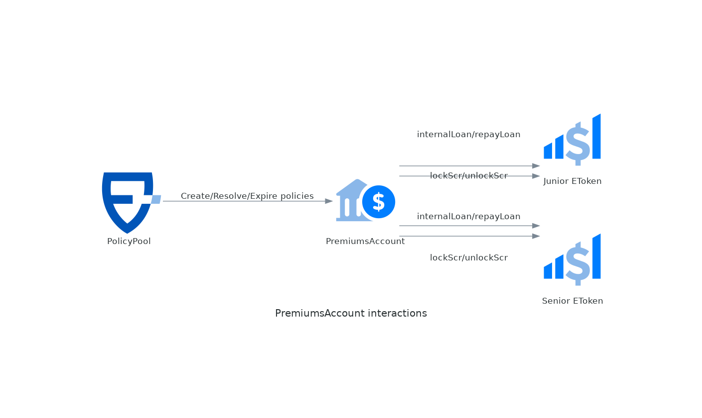

# PremiumsAccount

The risk modules are grouped in _premiums accounts_ that keep track of the pure premiums (active and earned) their policies. The responsibility of these contracts is to keep track of the premiums and release the payouts. When premiums are exhausted (losses more than expected), they borrow money from the _eTokens_ to cover the payouts. This money will be repaid when/if later the premiums account has a surplus (losses less than expected).

## **Roles**

The specific roles and functions of the contract are as follows:

| Role | Global | Description | Methods Accessible |
| --- | --- | --- | --- |
| LEVEL2_ROLE | ✓ | Mid-impact changes like changing some parameters. | [setDeficitRatio](premiumsaccount.md#setdeficitratio): Changes the deficitRatio parameter.<br>setLoanLimits: Changes the jrLoanLimit or srLoanLimit parameter. |
| REPAY_LOANS_ROLE | ✓ | Repayments of outstanding loans. | repayLoans: Repays the loan if funds are available. |
| WITHDRAW_WON_PREMIUMS | ✓ | Withdrawal of surplus from the PremiumsAccount. | [withdrawWonPremiums](premiumsaccount.md#withdrawwonpremiums):  Withdraws excess premiums (surplus) to the destination. |

( \* ) Global means that the role can be delegated to a user at the protocol level (for all components) or only for a specific component. Non-global roles can only be granted for a specific component.

## Interactions



## Parameters

| Field        | Type                    | Description                                                                                                                          |
| ------------ | ----------------------- | ------------------------------------------------------------------------------------------------------------------------------------ |
| deficitRatio | uint256 (wad)           | Usually 1.0 (max value). Controls the proportion of the active pure premiums that can be used to cover losses of finalized policies. |
| assetManager | address (IAssetManager) | Optional contract that, if present, implements the asset management strategy. See [IAssetManager](iassetmanager/overview.md).                   |

### Packed parameters

To save gas, the parameters are stored in a packed struct that fits in 256bits (a _word_ in the EVM). This is not visible externally, but put's limits on the precision of the parameters. The _wad_ ones, have 4 decimals as precision, so 1.12345 will be truncated to 1.1234.

## Events

### WonPremiumsInOut

```solidity
event WonPremiumsInOut(bool moneyIn, uint256 value)
```

Premiums can come in (for "free", without liability) with receiveGrant. And can come out (withdrawed to treasury) with withdrawWonPremiums

| Name    | Type    | Description                                |
| ------- | ------- | ------------------------------------------ |
| moneyIn | bool    | Indicates if money came in or out (false). |
| value   | uint256 | The amount of money received or given      |

## External Methods

### policyCreated

```solidity
function policyCreated(struct Policy.PolicyData policy) external
```

Adds a policy to the PremiumsAccount. Stores the pure premiums and locks the aditional funds from junior and senior eTokens.

Requirements:

* Must be called by `policyPool()`

Events:

* {EToken-SCRLocked}

| Name   | Type                     | Description                                     |
| ------ | ------------------------ | ----------------------------------------------- |
| policy | struct Policy.PolicyData | The policy to add (created in this transaction) |

### policyResolvedWithPayout

```solidity
function policyResolvedWithPayout(address policyHolder, struct Policy.PolicyData policy, uint256 payout) external
```

The PremiumsAccount is notified that the policy was resolved and issues the payout to the policyHolder.

Requirements:

* Must be called by `policyPool()`

Events:

* {ERC20-Transfer}: `to == policyHolder`, `amount == payout`
* {EToken-InternalLoan}: optional, if a loan needs to be taken
* {EToken-SCRUnlocked}

| Name         | Type                     | Description                                             |
| ------------ | ------------------------ | ------------------------------------------------------- |
| policyHolder | address                  | The one that will receive the payout                    |
| policy       | struct Policy.PolicyData | The policy that was resolved                            |
| payout       | uint256                  | The amount that has to be transferred to `policyHolder` |

### policyExpired

```solidity
function policyExpired(struct Policy.PolicyData policy) external
```

The PremiumsAccount is notified that the policy has expired, unlocks the SCR and earns the pure premium.

Requirements:

* Must be called by `policyPool()`

Events:

* {ERC20-Transfer}: `to == policyHolder`, `amount == payout`
* {EToken-InternalLoanRepaid}: optional, if a loan was taken before

| Name   | Type                     | Description                 |
| ------ | ------------------------ | --------------------------- |
| policy | struct Policy.PolicyData | The policy that has expired |

### seniorEtk

```solidity
function seniorEtk() external view returns (contract IEToken)
```

The senior eToken, the secondary source of solvency, used if the premiums account is exhausted and junior too

### juniorEtk

```solidity
function juniorEtk() external view returns (contract IEToken)
```

The junior eToken, the primary source of solvency, used if the premiums account is exhausted.

### purePremiums

```solidity
function purePremiums() external view returns (uint256)
```

The total amount of premiums hold by this PremiumsAccount

### activePurePremiums

```solidity
function activePurePremiums() external view returns (uint256)
```

Returns the total amount of pure premiums that were collected by the active policies of the risk modules linked to this PremiumsAccount.

### wonPurePremiums

```solidity
function wonPurePremiums() external view returns (uint256)
```

Returns the surplus between pure premiums collected and payouts of finalized policies. Returns 0 if no surplus or deficit.

### borrowedActivePP

```solidity
function borrowedActivePP() external view returns (uint256)
```

Returns the amount of active pure premiums that was used to cover payouts of finalized policies (in excess of collected pure premiums). This is limited by `_maxDeficit()`.

### surplus

```solidity
function surplus() external view returns (int256)
```

Returns the surplus between pure premiums collected and payouts of finalized policies. Losses where more than premiums collected, returns a negative number that indicates the amount of the active pure premiums that was used to cover finalized premiums.

### deficitRatio

```solidity
function deficitRatio() public view returns (uint256)
```

Returns the percentage of the active pure premiums that can be used to cover losses of finalized policies.

### setDeficitRatio

```solidity
function setDeficitRatio(uint256 newRatio, bool adjustment) external
```

Changes the `deficitRatio` parameter.

Requirements:

* onlyGlobalOrComponentRole(LEVEL2\_ROLE)

Events:

* Emits GovernanceAction with action = setDeficitRatio or setDeficitRatioWithAdjustment if an adjustment was made.

| Name       | Type    | Description                                                                                                                                                                                                                                              |
| ---------- | ------- | -------------------------------------------------------------------------------------------------------------------------------------------------------------------------------------------------------------------------------------------------------- |
| newRatio   | uint256 |                                                                                                                                                                                                                                                          |
| adjustment | bool    | If true and the new ratio leaves `_surplus < -_maxDeficit()`, if adjusts the \_surplus to the new `_maxDeficit()` and borrows the difference from the eTokens. If false and the new ratio leaves `_surplus < -_maxDeficit()`, the operation is reverted. |

### receiveGrant

```solidity
function receiveGrant(uint256 amount) external
```

Endpoint to receive "free money" and inject that money into the premium pool.

Can be used for example if the PolicyPool subscribes an excess loss policy with other company.

Requirements:

* The sender needs to approve the spending of `currency()` by this contract.

Events:

* Emits {WonPremiumsInOut} with moneyIn = true

| Name   | Type    | Description                   |
| ------ | ------- | ----------------------------- |
| amount | uint256 | The amount to be transferred. |

### withdrawWonPremiums

```solidity
function withdrawWonPremiums(uint256 amount, address destination) external returns (uint256)
```

Withdraws excess premiums (surplus) to the destination.

This might be needed in some cases for example if we are deprecating the protocol or the excess premiums are needed to compensate something. Shouldn't be used. Can be disabled revoking role WITHDRAW\_WON\_PREMIUMS\_ROLE

Requirements:

* onlyGlobalOrComponentRole(WITHDRAW\_WON\_PREMIUMS\_ROLE)
* \_surplus > 0

Events:

* Emits {WonPremiumsInOut} with moneyIn = false

| Name        | Type    | Description                                          |
| ----------- | ------- | ---------------------------------------------------- |
| amount      | uint256 | The amount to withdraw                               |
| destination | address | The address that will receive the transferred funds. |

| Name | Type    | Description                          |
| ---- | ------- | ------------------------------------ |
| \[0] | uint256 | Returns the actual amount withdrawn. |

## Inherited from Reserve

### assetManager

```solidity
function assetManager() public view virtual returns (contract IAssetManager)
```

Returns the address of the asset manager for this reserve. The asset manager is the contract that manages the funds to generate additional yields. Can be `address(0)` if no asset manager has been set.

### setAssetManager

```solidity
function setAssetManager(contract IAssetManager newAM, bool force) external
```

Sets the asset manager for this reserve. If the reserve had previously an asset manager, it will deinvest all the funds, making all of the liquid in the reserve balance.

Requirements:

* The caller must have been granted of global or component roles GUARDIAN\_ROLE or LEVEL1\_ROLE.

Events:

* Emits ComponentChanged with action setAssetManager or setAssetManagerForced

| Name  | Type                   | Description                                                                                                                                                                                                                        |
| ----- | ---------------------- | ---------------------------------------------------------------------------------------------------------------------------------------------------------------------------------------------------------------------------------- |
| newAM | contract IAssetManager | The address of the new asset manager to assign to the reserve. If is `address(0)` it means the reserve will not have an asset manager. If not `address(0)` it MUST be a contract following the IAssetManager interface.            |
| force | bool                   | When a previous asset manager exists, before setting the new one, the funds are deinvested. When `force` is true, an error in the deinvestAll() operation is ignored. When `force` is false, if `deinvestAll()` fails, it reverts. |

### rebalance

```solidity
function rebalance() public
```

Calls {IAssetManager-rebalance} of the assigned asset manager (fails if no asset manager). This operation is intended to give the opportunity to rebalance the liquid and invested for better returns and/or gas optimization.

* Emits {IAssetManager-MoneyInvested} or {IAssetManager-MoneyDeinvested}

### recordEarnings

```solidity
function recordEarnings() public
```

Calls {IAssetManager-recordEarnings} of the assigned asset manager (fails if no asset manager). The asset manager will return the earnings since last time the earnings where recorded. It then calls `_assetEarnings` to reflect the earnings in the way defined for each reserve.

* Emits {IAssetManager-EarningsRecorded}

### checkpoint

```solidity
function checkpoint() external
```

Function that calls both `recordEarnings()` and `rebalance()` (in that order). Usually scheduled to run once a day by a keeper or crontask.

### forwardToAssetManager

```solidity
function forwardToAssetManager(bytes functionCall) external returns (bytes)
```

This function allows to call custom functions of the asset manager (for example for setting parameters). This functions will be called with `delegatecall`, in the context of the reserve.

Requirements:

* The caller must have been granted of global or component roles LEVEL2_ROLE._

| Name         | Type  | Description                        |
| ------------ | ----- | ---------------------------------- |
| functionCall | bytes | Abi encoded function call to make. |

| Name | Type  | Description                                                                     |
| ---- | ----- | ------------------------------------------------------------------------------- |
| \[0] | bytes | Returns the return value of the function called, to be decoded by the receiver. |
