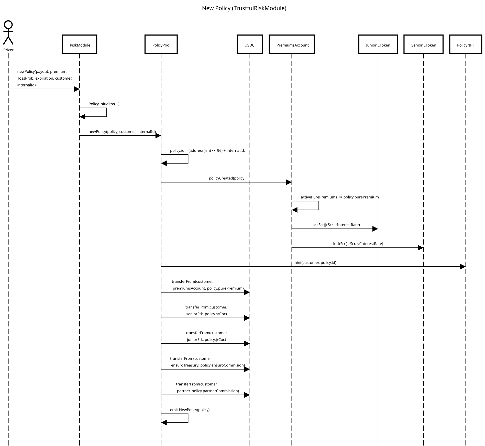
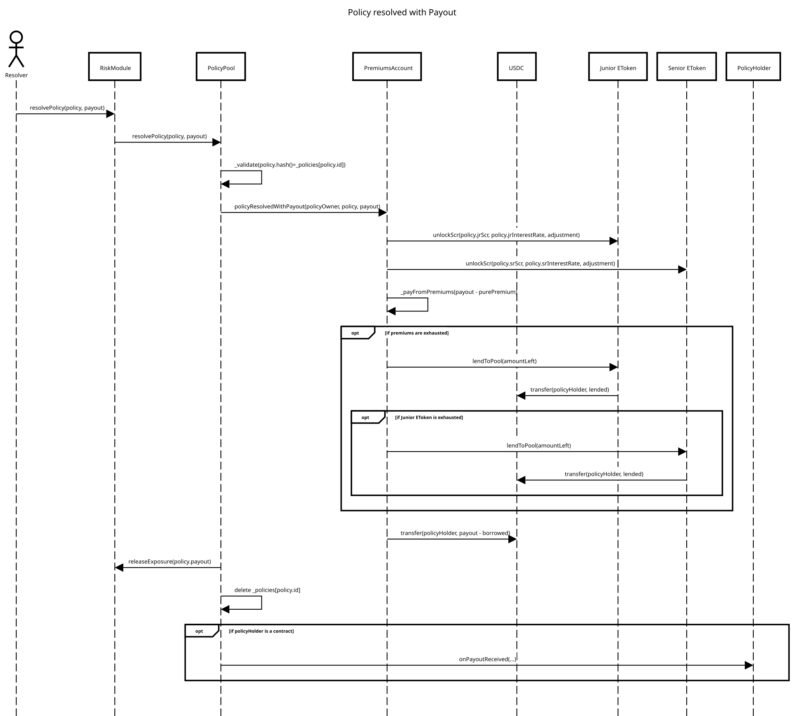
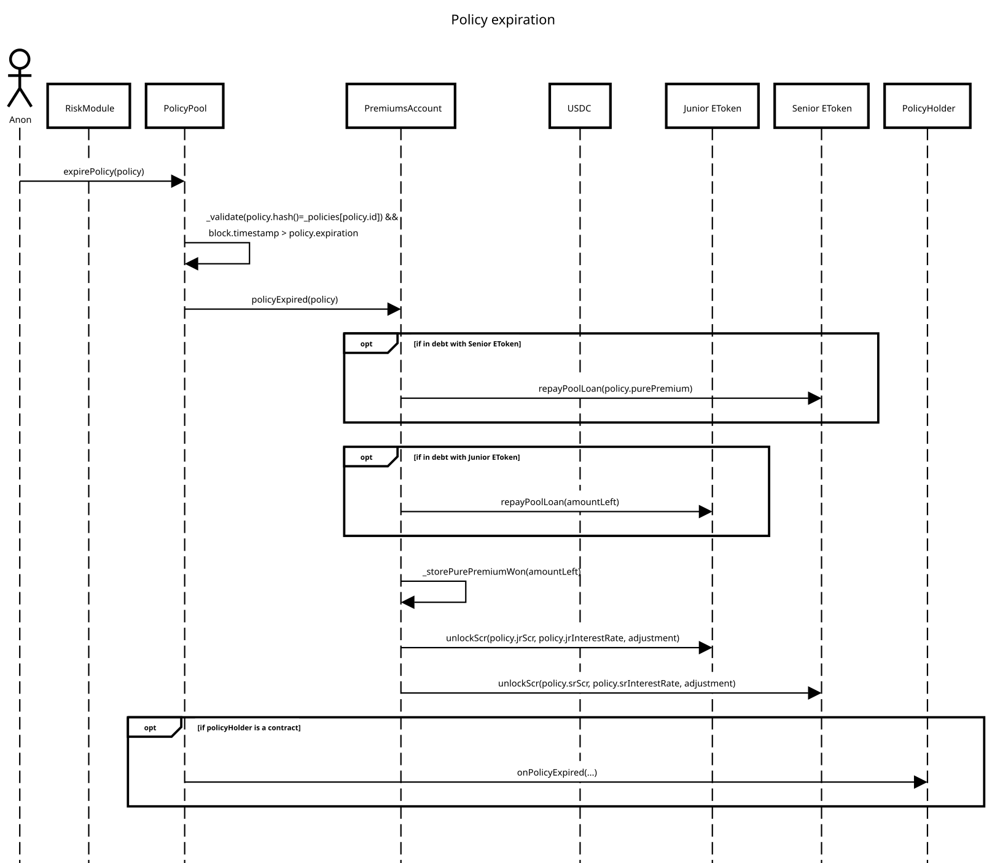

# Policy Lifecycle

## New Policy

New Policy transactions are sent to _risk modules_. Each risk module has its logic related to how to validate/calculate the parameters of the policy. The input parameters for creating a policy are:

* **payout**: the maximum amount paid for this policy to the policyholder.
* **premium**: the amount paid as a premium.
* **lossProb**: the estimated probability of having to do a payout equal to the maximum payout.
* **expiration**: the expiration date of the policy (timestamp). After this date, the policy is no longer claimable.
* **internalId**: a user-defined id that has to be unique within a risk module.

> **Note:** The **lossProb** is used to calculate the expected losses of a policy. If the policy can have multiple payouts, the lossProb is computed as the ratio between expected losses and maximum payout. For example, if the maximum payout is $ 100, and the payouts can be $ 100 with 10% of chances and $ 50 with 10% of chances, then the lossProb will be 15% (= ($100\*10% + $50\*10%) / 100$ ).

Based on the input parameters and the risk module's parameters, a [Policy](policy.md) is created and sent to the _PolicyPool_.

Here you can see a sequence diagram of the process with all the contracts involved. As a final result, we should see the following effects:

1. A new Policy is _stored,_ and an NFT is minted for the customer. The NFT represents the policy's ownership, and the owner of the NFT will receive the payout.
2. The solvency capital sourced from the liquidity pools (_eTokens_) is locked until the policy is triggered or expires.
3. The premium amount is transferred from the customer and split among the different parties:
   1. The cost of capital is paid to the junior and senior eTokens.
   2. The commissions are paid to Ensuro and the risk partner.
   3. The pure premium is sent to the PremiumsAccount contract associated with the risk module.
4. A NewPolicy event with all the Policy fields that will be needed for upcoming operations.

[Open the sequence diagram in a new window](https://sequencediagram.org/index.html?presentationMode=readOnly#initialData=C4S2BsFMAIDlIO7QAoHtwgMYE9oAoAVAJwFcBnYAMxPACUQyBrAWVQBMbIBKAKB4ENMwVERREskIjwAO-IqEwhZAO2DR6TVhygy5Cpf1Up0WbGnS75WA0YCqAZQAiAYT59k4zJIC0APg0s7JwAXMqIaBg4eLLYqCTAADTQ0kSQALYgJGkJADrK0OCoZGQeqABGSZAAHtIgRPygqMpJmOTCaZJJeSCqksr84ACSbLwBWpx+Y0FQwcaR2AB0PWAgAyAAXpB4CzujDIHakH4RpubgoeEmUdJX2C1tqB1EST3AfQPDvCc4Z8e3Z7MbvMlmxoABefD8NhsVLFPBENJcaAAHmR0AAnAA2JEAamgr3eQzYAG4eN8zKh0MdUhksmQAIKYTBxVSA27OVINSBsaK3L40zJpBlMlnAanpQXC5kkVnQQSgABukGQJFSHgldOgOIhQNMC2kquVAqyZONQsZ0tUfgAUjKQCJoABRAioRiQZSzQqYRj2TBEPAAKyIvue0CDg16sOAtC5-I15pFMrFvns7vtomdrvdntQ3pDeDIwb9SULEbeUZjby+-0p4D+81gADECLMMqo8K0KI9OslbiDq-Nfr4HC5ZsB6soyJRJI2iI8Ow8nrl8il41LRUldTh9Yb1bTEWSa1Th05nGOJ1OZ3O0guu0u8tAyGmRI7gIxN33C85cwPTrW-COZ7QOOhiXkQs7zp27SdA+AZ2i+b4fsCQbfpgv4-P+J6jsBF7TuB163tBzwPu6ZCqqgxCQPwZFEHcvbAqR5HfmkGRkPayjoRSx6AeeoF4RBN5Qd2xErnoYShluiyyPI4nMaxbFNJxQ7kgC0ASmo8AIOSvLzLwQA).

> **Note:** The sequence diagram above is based on the _TrustfulRiskModule_. In this particular implementation of the risk module, the policies can only be created by users with a specific delegated role. In this way, they can define critical parameters like the _lossProb_.
>
> There are other implementations of risk modules where the lossProb and other policy parameters are calculated in the risk module from other specific policy parameters.

In the process of creation of a policy, several things are validated and can fail, reverting the operation:

* Some of the policy's features, like policy duration, maximum payout per policy, and maximum exposure, exceed the risk module limits and are not validated by the risk module.
* Risk module deprecated or suspended.
* Lack of available funds in the eTokens to cover the required solvency capital (SCR).
* Not enough funds in the customer's wallet to pay the premium or no allowance for spending given to the PolicyPool.
* Repeated policyId/internalId (used to avoid repeated transactions).

## Resolution with payout

The resolution of the policies when there is a payout is triggered from the _risk modules_. The criteria for triggering a payout change from one module to the other: some risk modules use information from _oracles_ to define if a policy is triggered, while others rely on a trusted user (EOA) with a designated role.

Below you can see a sequence diagram of the process with all the contracts involved. As a final result, we should see the following effects:

1. The payout has been sent to the PolicyHolder.
2. The solvency capital (SCR) is unlocked.
3. The funds to cover the payout are taken from the premiums, the junior eToken, or the senior eToken (in this order).

[Open the sequence diagram in a new window](https://sequencediagram.org/index.html?presentationMode=readOnly#initialData=C4S2BsFMAIAUHtwgMYE9oCdIGdEDdIATaAdzAAs4BDVeAV2AChGrlh4NoAlHfSDRgAcqGUMhDCAdsG4hsAawCy8QnShCRYiVWlxEKVAkQbRKbbthYAtiDpXsAQWTJ60k1qkyAqgGUAIgDC7mae0ABSdJIgHNAAogAq8PKQksHioT4p0ZwJSSnMzDy44AQYALQAfFxySipqkABcWMUECEhoABSC+mgANNDCtAwAlIzVCsqqUJVtBkbgTbwlkLOd3e2o-YP0wKOrhvCIMz0HiA3QAPp4VEiEVMCQXScAdORU2OQdwwC8F+tmOAA2v80M8QIQALp7E7zGbWWz2JwuSLAc4g1BFPiEADqFFgNB2Tw2AHkSJJ+FsTlsCSNGJZIDY7I5nK5gJUIlEYrlkpJzpFwPBkPIfMgMESDM8AFYYEUYSkbKUYACS0n4OGAXHukH6VEIkro2GAVhSuzp8KZSNZlUynJyiR5fMkAqFsvFoOwMtF8olHpVD2aGq1Or1BqNJr25sRLJRcIZCOZyOk5z+NAAYhh4FZ6Yz7F0aTIygM6FhswjRvBBDIQAAzAaR7DQEQwSAADzeoaIZrjFuj0nZkWycXtKXOUEkhES8w6VCsrIAMpBq6aOYPuSlKr5AudgBgdNhq-w3agABKIQgU6Bj8+EcuV6A18IDrnDyT3hut9uGzulnuJtkVG1VxfUcUgneApxnedF1NQDnzySQN38AJt13SR90PdFT3Ac85UvUCiFGUDGCIn8oz-RCt2gHc9wPMVMLPC9tgYaBCwAIw4DMSAIukYUOcBKnGWopkaTBICgd5IFiFtumwYtHnRZ4mNNfZYQqFS+POc8oAeS4QRAIEFPBCFGArKta3o7D+DfRtoBcaRdzYHiNlU-YsJw854EkfEhg1SBkEgEACEIDpnlCwjxyAA).

In the process of policy resolution, several things are validated and can fail, reverting the operation:

* The policy doesn't exist. This might happen if the risk module receives a wrong input or if the policy has already been resolved. It is validated using the policy hash.
* The policy has already expired.
* The risk module is suspended.
* Both premiums, junior eToken and senior eToken are exhausted, and not enough money for the payout. It shouldn't happen with a correct _collateralization ratio_.

> **Note:** **Adjustment**: you can see in the diagram that _unlockScr_ calls include an adjustment parameter.
>
> When policies are created, a premium fraction is used to pay the cost of the solvency capital locked for the policy. That cost of capital is received in bulk at the policy creation but released as a progressive interest rate to the LPs.
>
> When the policy is resolved, it will be _before_ the expiration, when part of the cost of capital is still not disbursed. So this adjustment disburses the remaining cost of capital not yet accrued because of the early finalization of the policy.

> **Note:** The policyholder can be any Ethereum address; this includes EOAs (externally owned accounts) and contracts. If the policyholder is a contract, a specific callback is called to notify it of the payout. The callback can be used in the policyholder contract to do something with it, like covering a liquidation position, swaps, or transfers.

> **Note:** **Internal loans**: most of the time, if a model is well-calibrated, the premiums should cover the losses. But even in well-calibrated models, because of the deviations of random variables around the mean, in some cases, premiums are not enough, and we need to use the solvency capital from the junior or senior _eTokens_.
>
> When we do so, the _total supply_ of those eTokens is reduced, producing a **negative** return to the LPs. This money is taken as a loan from the eToken to the _PremiumsAccount_.
>
> But as well as random variables might be sometime above the mean (losses more than expected), in the future, they might be below the mean (losses less than expected). When that happens, premiums will be accumulated, and if the _PremiumAccount_ has a debt with the eToken, it will repay the debt producing a **positive** return to LPs.

## Resolution at expiration

Every policy, when created, has an expiration date. After that date, anyone can issue an expiration transaction. This expiration transaction is needed to unlock the solvency capital reserved for that policy since it's no longer claimable.

Here you can see a sequence diagram of the process with all the contracts involved. As a final result, we should see the following effects:

1. The solvency capital (SCR) is unlocked.
2. The PremiumsAccount earns the _pure premium_.
3. If the premiums account has outstanding loans with the Senior or Junior eTokens, it uses the _pure premium_ earned to repay its debts (with that precedence).
4. The remaining pure premium is accumulated in the PremiumsAccount contract.

[Open the sequence diagram in a new window](https://sequencediagram.org/index.html?presentationMode=readOnly#initialData=C4S2BsFMAIAUHtwgMYE9qQB4AcQCcBDUeAOwCgyDlh49oBBE0s7AvUZEVk4aAJRABnANYBZeABMArlBZsOXAjziIUqBIjnsUi5bDyQAtiCmHB9ZMnhSeWhd14BVAMoARAMJ2dD6ACkbILTQAKIAKvDCkOSs2pw+zlGBdGERURQUjKQAtAB8CEhoGuAAXFi4BvlqABTYqmgAlGSVhfCIuc3qrSXQAPoAbgRIEkSQNXWoAHQAFgSCU1X1ALw9tQUgkIIA2qtqEyASALr10ABkJ9AAOiTQAEbg8MjCE6CGG8AEhtjQOdA7aBNlfBEQLkDpFdoGYymcyWaw8Yq-cbBHD4SASMYFVCNeDYXggABm0BA1wkkBuvAA7mAptAEiQkiFwpFQZCTGYLFYbMBcnSGSlmQiDKxOogADLwJQY3bYKQVVmmRpRCRkHF4wnE6Ck8nQKnAGn+elBflpfRGNkwzk8XIGvlMqKCyDCoriyUfOHAUWQfHARUkZWmqHs2FciFm6Ec90InqCGgVWWQANsgDqpCqbq5nu9jUT4eDVpyNqNdpICJs90ezmQeCl-wAVnhK3gADSIzETesASR4kAMMb4IxbBAktakMdePGz8qDlu5OV5RdSJegZYewkbNcmggbVZbf03eC7wB7b37R8Hw9HwHHPpVuKJhL3AAlEKS6EJoARoFYeIRqE1xuCeTjM+4CvgipAdMi5RolUExwb6EhAA).

In the process of policy resolution, several things are validated and can fail, reverting the operation:

* The policy doesn't exist or is not expired (i.e., its _expiration date_ has not come yet).
* The risk module is suspended.

> **Note:** Any user can call the `expirePolicy` function after the expiration of a policy. Ensuro has processes running and checking the database of policies to run these expiration transactions. But since it's an open end-point, anyone can call it, guaranteeing to the _liquidity providers_ that their funds won't be locked indefinitely.
