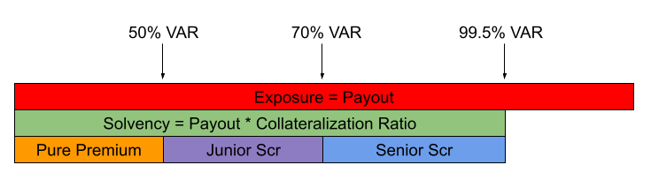

# Policies

Policies are a struct with the following data:

| Field             | Type                  | Description                                                                                                                                                                               |
| ----------------- | --------------------- | ----------------------------------------------------------------------------------------------------------------------------------------------------------------------------------------- |
| id                | uint256               | 
Unique id of the policy within the protocol. This id is created combining the risk module address and an internalId. <code>id = address(rm) << 96 + internalId</code>
 |
| payout            | uint256 (amount)      | The maximum payout to be paid for this policy.                                                                                                                                            |
| premium           | uint256 (amount)      | The premium paid for this policy                                                                                                                                                          |
| jrScr             | uint256 (amount)      | The junior solvency capital (see breakdown below)                                                                                                                                         |
| srScr             | uint256 (amount)      | The senior solvency capital (see breakdown below)                                                                                                                                         |
| lossProb          | uint256 (wad)         | The probability of having to pay the maximum payout (see lossProbe note [here](policy-lifecycle.md#new-policy))                                                                           |
| purePremium       | uint256 (amount)      | 
The expected loss for the policy. It's calculated as: <code>purePremium = payout * lossProb * rm.moc</code>
                                                                     |
| ensuroCommission  | uint256 (amount)      | Ensuro's commission (see premium split below)                                                                                                                                             |
| partnerCommission | uint256 (amount)      | Risk partner's commission (see premium split below)                                                                                                                                       |
| jrCoc             | uint256 (amount)      | The cost of capital paid for the Junior Solvency (jrScr).                                                                                                                                 |
| srCoc             | uint256 (amount)      | The cost of capital paid for the Senior Solvency (srScr).                                                                                                                                 |
| riskModule        | IRiskModule (address) | The risk module that created the policy.                                                                                                                                                  |
| start             | uint40 (timestamp)    | The timestamp when the policy was created                                                                                                                                                 |
| expiration        | uint40 (timestamp)    | The timestamp when the policy expires                                                                                                                                                     |

> **Note:** **amount**: fields indicated as amounts represent amounts in the currency used by the protocol (typically USDC) and with the same number of decimals (6 for USDC).
>
> **wad**: fields indicated as **wad** are numbers represented as ints where the first 18 digits are decimals.
>
> **timestamp**: date/time expressed as Unix date (seconds since 1/1/1970 UTC).

## Solvency breakdown

Some policy fields relate to how the policies' solvency capital is computed; we describe them in the following.

The solvency capital for each policy is the product of two metrics: the policy's _payout_ and _collateralization ratio._ The _payout_ field defines the maximum exposure for a given policy. The _collateralization ratio_ defines the portion of the maximum payout that needs to be stored in the protocol to guarantee solvency up to a desired probability. It is a parameter at the risk module level needed and is computed by Ensuro's quantitative team via stochastical modeling of the portfolio.

> **Note:** **A simple example for explaining the collateralization ratio**
>
> If you toss 1000 coins, there are >99.5% chances that the number of heads is less or equal to 541 (check [Binomial distribution](https://en.wikipedia.org/wiki/Binomial_distribution) formulas). If our policy pays $ 1 for each tossed coin that gets a head, the size of our portfolio is around 1000 policies, and we want to cover losses with a confidence level of 99.5%, we can keep the collateralization ratio to 54.1% and lock only 0.541 dollars for each policy.

Again, the _collateralization ratio_ times the _payout_ gives the amount of solvency we need. Part of the solvency comes from the _pure premium_ and covers the expected losses. The rest of the solvency is provided by two capital pools (eTokens), the junior eToken and the senior eToken. Another risk module parameter, the junior collateralization ratio, defines the split between these two capital pools.

All these values are calculated on policy creation, used to lock the different components of the solvency, and are immutable.

> **Note:** The confidence levels that define the solvency breakdown might change from one product to another. Some products might even be fully collateralized (confidence level = 100% = collateralization ratio).
>
> The confidence level used for the junior eToken is also a business decision. In some cases, where there is some uncertainty around a model's performance,  we might allocate as pure premium more than expected losses (see MoC parameter in RiskModule).

> **Note:** **Full example for our **_**tossing coin insurance**_**:**
>
> As mentioned, 54.1% is the _collateralization ratio_ for 99.5% confidence. If we take 70% confidence, the _junior collateralization ratio_ will be 50.8%. And as we know, chances of getting a head are 50%.
>
> So, for a $ 1 payout, the solvency will be $ 0.541 broken down this way:
>
> * pure premium = $ 0.50
> * Junior Scr = $ 0.008
> * Senior Scr = $ 0.033

## Premium split

The premium paid by the policyholder needs to cover different costs/fees: the expected losses, the cost of capital and the risk exposure of the additional capital locked, and the fees for Ensuro and the risk partner.

### Pure Premium

$$
purePremium = payout  * lossProb * rm.MoC
$$

​Both _payout_ and _lossProb_ are parameters that come as an input, policy by policy, validated by the risk module Smart Contract.​

The _MoC (Margin of Conservatism)_ is a parameter at the risk module level. It is used to mitigate the risk coming from uncertainty around models' performances. It is equal to 1.0 in the neutral case and > 1.0  for uncertain models. It gurantees an additional layer of protection for the LPs. If the performance shows we overestimated the losses and we have accumulated premiums, it might be adjusted with an MoC less than 1.0.

### Junior and Senior Cost of Capital

$$
jrCoc = jrScr * rm.jrRoc * (expiration - start) / secondsPerYear
$$

​The _Junior Cost of Capital_ (and, analogously, the _Senior CoC_) is calculated as an interest to be paid for the capital locked. It is the product of the _jrScr_ (explained in the section above), the duration of the policy (as a fraction of the year), and the _jrRoc_, a risk module parameter that defines the annualized return expected by the liquidity providers.

### Ensuro commission

$$
ensuroCommission = purePremium * rm.ensuroPpFee + (jrCoc +srCoc)*rm.ensuroCocFee
$$

​The commission charged by the protocol is based on two parameters defined at the risk module level, a percentage on the pure premium and a percentage on the cost of capital. This pricing structure is flexible enough to provide a fair price for a diverse set of products.

### Minimum premium

These three components define the minimum value the protocol accepts as the premium for the policy.

$$
minimumPremium = purePremium + jrCoc + srCoc + ensuroCommission
$$

### Partner commission

$$
partnerCommission = premium - minimumPremium
$$

Finally, the partner commission is whatever exceeds the minimum premium. Hence, our partners are free to define their margins with their unique knowledge of the market and their costs.

## Policy Ids

Each policy is identified by a unique id. The policy-ids are guaranteed to be unique for each policy created and they can't be reused even if the policy expired.

This policy-id is also the id of the NFT representing the ownership of the policy that's minted when the policy is created.

The policy NFTs aren't burnt when the policy expires or is resolved. They are pretty useless after the policy expires, so don't buy them unless you want a souvenir!

The policy id is a 256-bit integer where the first 160 bits match the address of the risk module that created the policy. The remaining 96 bits (called the internal id) are a number that must be unique within the policies created by the module.

The allocation of these internal ids can be managed by the risk module (for example keeping an internal counter) or it might be assigned by the callers as a parameter.

### Deterministic policy ids

Even when is not a requirement, is desirable for the strategy for assigning the _internal-ids_ and consequently the _policy-ids_ to be deterministic as a function of input parameters and independent from the state of the contracts.

This makes it easier to send the transactions for several policies in an asynchronous way, without waiting for the execution of the transactions. Also, it is safer because it prevents duplication of policies when retrying the creation of a policy because if a transaction is sent twice, the 2nd one will fail because of duplicated id.

If, instead of using a deterministic id based on the input parameters, a risk module where using, for example, an internal counter, the policy id will be dependent on the order of creation of the policies and the called should take care of not creating duplicated policies.

## On-chain storage

Given that the Policy struct has many fields and storage is expensive on-chain, the struct is not stored as a storage variable of the contracts. 

Instead, when the policy is created, only a hash of the struct is stored, and an event with all the fields is emitted. Then, for any operation with the Policy (like resolution or expiration), all the policy needs to be sent as a parameter. The PolicyPool contract computes the hash of the parameter and compares it with the stored one.
