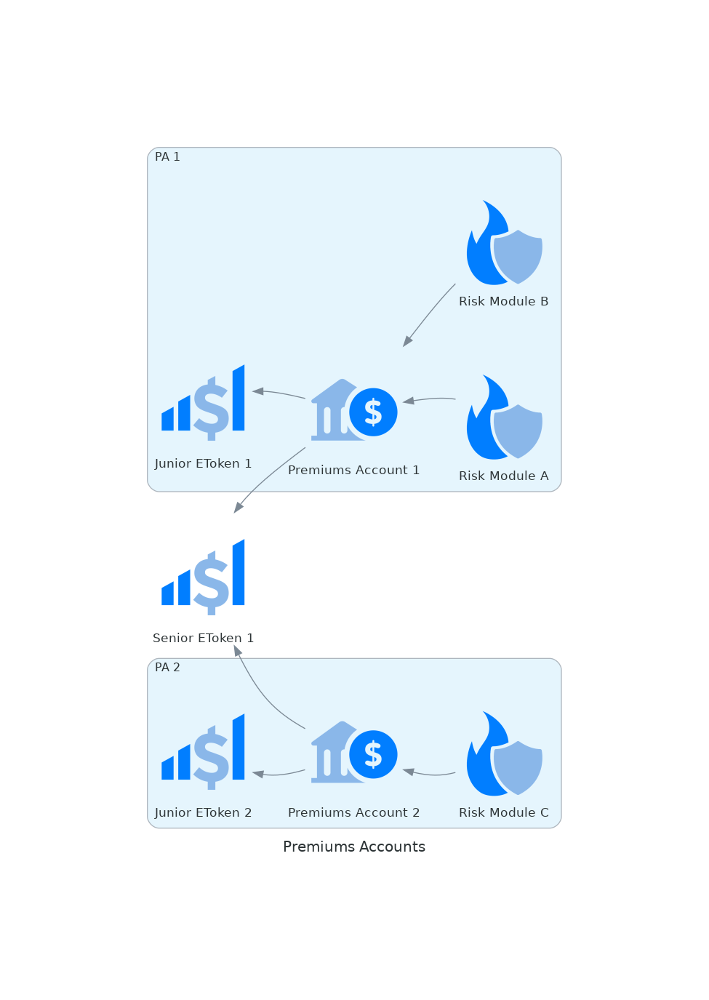

# Premiums Accounts

Every policy sold pays a premium; part of that premium is the pure premium. The losses for a sustainable insurance product should be less or equal to the pure premiums collected. This condition doesn't always need to be true, but it should be respected in the long term.

As the first source of capital to cover the losses, premiums are used up to their total exhaustion before accessing other capital sources (junior and senior eTokens).

Several kinds of risks coexist in Ensuro's protocol, often provided by different risk partners. For business and risk-related reasons, we don't want to mix all the premiums from these different sources. Consequently, the protocol has several _Premiums Accounts_ that separate the different premium streams, each account collecting the pure premiums from one or more risk modules.

On the solvency side, each Premiums Account might be linked to a junior eToken and a senior eToken, to back up the solvency needs when premiums are exhausted.

## Pure premiums

The _premiums account_ contract keeps track of the pure premiums. On one side, it tracks the _active pure premiums_, i.e., the pure premiums of the active policies of the connected _risk modules_.

Pure premiums accounts earn funds when a policy expires and have losses when there's a payout. For covering the losses, the precedence is:

1. _**Won pure premiums**_: the accumulated surplus of premiums earned from past expired policies.
2. **Borrow from active premiums**: the pure premiums of active policies are used for payouts.
3. _**Junior eToken**_: takes an [internal loan](liquidity-pools.md#internal-loan) from the junior eToken.
4. _**Senior eToken**_: takes an [internal loan](liquidity-pools.md#internal-loan) from the senior eToken.

The contract tries each source of capital, going to the next one only if unable to cover the payout.

When policies expire, the earned pure premium is used for:

1. _**Repay Senior eToken debt**_: [repay the internal loan](liquidity-pools.md#internal-loan-repayment) with the Senior eToken if they were any debt.
2. _**Repay Junior eToken debt**_: [repay the internal loan](liquidity-pools.md#internal-loan-repayment) with the Junior eToken if they were any debt.
3. _**Reimburse borrowed active premiums**_ if active pure premiums were used for payouts.
4. _**Accumulate as won pure premium**_: if none of the previous debts are outstanding, it accumulates the surplus as _won pure premiums_.
